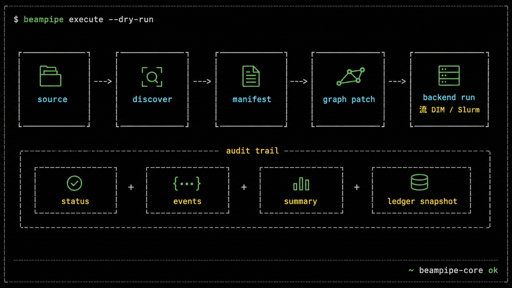
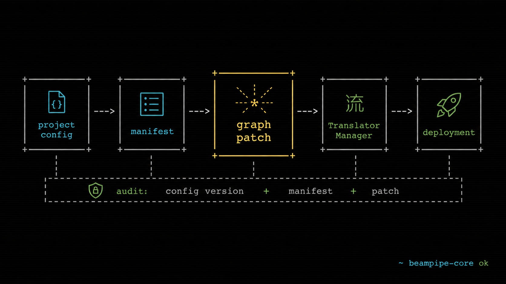
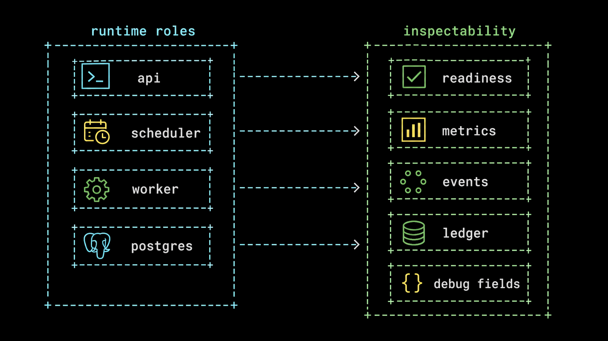

<p align="center">
  
</p>


> `beampipe-core` is an external orchestration and triggering framework for archive-driven radio astronomy workflows. It operates as an external control plane that continuously monitors scientific archives (ie; CASDA), determines when datasets are ready, and orchestrates scheduler-aware execution of distributed workflows (ie; DALiuGE) on heterogeneous HPC systems.

<p align="center">
  
  
  
  
</p>

<p align="center">
  
</p>

## `What it does`

> - **`Archive-driven triggering`**: discovers newly deposited datasets via polling or event-style ingestion and triggers processing automatically.

> - **`Idempotent run ledger`**: records each trigger to guarantee completeness, avoid duplicate processing, and enable safe retries.

> - **`Scheduler-aware orchestration`**: submits workloads to batch schedulers with queue/cluster constraints in mind.

> - **`Workflow-agnostic execution`**: treats pipelines as portable work items to support [DALiuGE](https://daliuge.icrar.org/) or future WMS.

<h1 align="center">
  <a href="https://beampipe.jackblackwood.com/"><kbd>&gt; docs</kbd></a>
  &nbsp;&nbsp;
  <a href="https://beampipe.jackblackwood.com/api/reference/"><kbd>&gt; api</kbd></a>
</h1>


## `Quick Start`

> Use the single `beampipe` binary for host and container workflows.
> The Docker image uses the same entrypoint, so `docker compose run api migrate` and `beampipe migrate` exercise the same command surface.

<pre>
+-- terminal ---------------------------------------------------------------+
| docker compose up -d postgres                                            |
| beampipe init --directory operator-local                                 |
| cd operator-local                                                        |
| beampipe setup --yes --admin-password 'replace-this-local-password' \    |
|   --project-config ../config/wallaby_hires.v2.yaml                       |
| beampipe doctor                                                          |
| beampipe start                                                           |
+-------------------------------------------------------------------------+
</pre>

> Inspect the live PostgreSQL-backed control plane from another shell:

```bash
cd operator-local
beampipe status
beampipe console
```

## `One Binary`

> The CLI is defined as `beampipe` in `crates/beampipe-cli/Cargo.toml`.
> Operator-facing examples should prefer the installed `beampipe` binary.

| Command | Purpose |
|---------|---------|
| `beampipe init` | Create safe local and production configuration templates |
| `beampipe setup` | Configure PostgreSQL, admin, CASDA, DALiuGE, SLURM, profiles, and workers |
| `beampipe doctor` | Run dependency, migration, SSH, scheduler, graph, and worker diagnostics |
| `beampipe start` | Start the API and embedded worker for a compact deployment |
| `beampipe console` | Open the live terminal operator console |
| `beampipe serve` | Run the HTTP API, optionally with embedded worker ticks |
| `beampipe serve --worker false` | API-only process |
| `beampipe worker` | Worker-only process |
| `beampipe migrate` | Apply database migrations |
| `beampipe admin create-user` | Create an operator account |
| `beampipe project validate` | Validate project config YAML/JSON |
| `beampipe graph prepare` | Build and checksum a manifest/patched graph without submission |
| `beampipe execution retry` | Retry only a provably safe failed stage |
| `beampipe execution cancel` | Confirm external cancellation and audit the action |
| `beampipe wasm upload` | Upload WASM hook modules |
| `beampipe slurm ping` | Smoke-test Slurm SSH configuration |
| `beampipe openapi export` | Export the OpenAPI contract |

## `Run Modes`

<pre>
+-- run modes --------------------------------------------------------------+
| binary on PATH       preferred operator path                              |
| Docker Compose       typical local / small-deploy stack                   |
| source build         cargo build --release -p beampipe-cli --bin beampipe |
| cargo run            development only; same CLI after Cargo compiles      |
+-------------------------------------------------------------------------+
</pre>

### `Binary on PATH`

> Preferred for operators and production-style process splits.

```bash
beampipe init
beampipe setup
beampipe doctor
beampipe serve --worker false
BEAMPIPE_WORKER_SCHEDULER_ENABLED=false beampipe worker
```

### `Docker Compose`

> Compose starts PostgreSQL, an API process, a scheduler process, and worker replicas.
> Migrations and the first admin user are intentional one-time operator steps.

```bash
docker compose build api
docker compose up -d
docker compose run --rm api migrate
docker compose run --rm api admin create-user \
  --username admin \
  --password 'replace-this-local-password' \
  --email admin@example.test
```

> Optional observability:

```bash
docker compose --profile observability up -d
```

### `Build from Source`

> Build the release binary locally when there is no downloaded artifact on `PATH`.

```bash
cargo build --release -p beampipe-cli --bin beampipe
target/release/beampipe migrate
target/release/beampipe serve --worker false
```

> For development on the host, keep Postgres in Docker and run through Cargo:

```bash
docker compose up -d postgres
cargo run -p beampipe-cli --bin beampipe -- migrate
cargo run -p beampipe-cli --bin beampipe -- serve
```

## `Control Plane`

<p align="center">
  
</p>

> beampipe-core does not replace the science workflow.
> It prepares and submits work to the configured backend while keeping state, provenance, and retries in PostgreSQL.

## `Project Configs and DALiuGE Graphs`

<p align="center">
  
</p>

> Project configs are YAML documents (`apiVersion: beampipe.dev/v2`) that define archive adapters, discovery queries, metadata transforms, manifest shape, DALiuGE graph patches, automation caps, and optional WASM hooks.

```yaml
apiVersion: beampipe.dev/v2
kind: ProjectConfig
metadata:
  id: wallaby_hires

adapters:
  required: [casda]

graph:
  url: https://example.org/wallaby.graph

graph_patches:
  - match:
      kind: node_name
      equals: Scatter/GenericScatterApp/Beam
    set:
      num_of_copies: "$count(sbids[].datasets[])"
```

> Existing DALiuGE graphs can include the `beampipe-ingest` palette.
> At submit time, beampipe looks for a node named `beampipe-ingest` with a `manifest_path` field, creates a readonly graph configuration, and embeds the generated manifest JSON before translation.

## `API and Tools`

> The Rust API is mounted at `/api/v2`.

| Tool | Purpose |
|------|---------|
| Swagger UI | `GET /api/v2/docs` |
| OpenAPI JSON | `GET /api/v2/openapi.json` |
| Health | `GET /api/v2/health` |
| Readiness | `GET /api/v2/ready` |
| Metrics | `GET /metrics` |
| Redoc | MkDocs page at `boilerplate_docs/api/reference.md` |

> Export the OpenAPI contract:

```bash
beampipe openapi export > openapi.json
cp openapi.json boilerplate_docs/openapi.json
```

> Use the MkDocs API workflow and Bruno documentation for login, project config upload, source registration, discovery, execution, and polling examples.

## `Documentation`

<p align="center">
  
</p>

| Page | Link |
|------|------|
| Home | [Documentation home](https://beampipe-core.readthedocs.io/) |
| Start | [Choose a setup path](https://beampipe-core.readthedocs.io/getting-started/) |
| Operate | [Operator handbook](https://beampipe-core.readthedocs.io/operations/) |
| Configure projects | [Project config YAML](https://beampipe-core.readthedocs.io/project-configs/) |
| Understand | [Architecture map](https://beampipe-core.readthedocs.io/architecture/) |
| CLI reference | [Command families](https://beampipe-core.readthedocs.io/reference/cli/) |
| API workflow | [Task-oriented API guide](https://beampipe-core.readthedocs.io/api/) |
| API schema | [Generated API reference](https://beampipe-core.readthedocs.io/api/reference/) |

## `Contributing`

```bash
cargo test
python3 -m mkdocs build --strict
beampipe openapi export > openapi.json
```

> Keep examples on `/api/v2`, prefer the `beampipe` binary in operator-facing commands, and update Redoc/Bruno examples whenever request or response schemas change.
