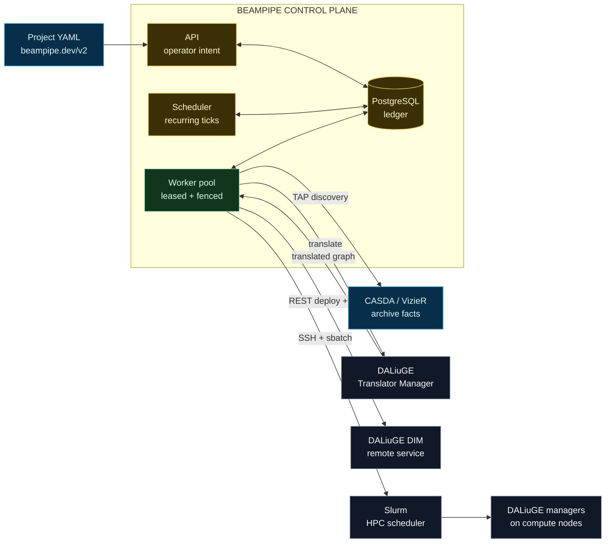
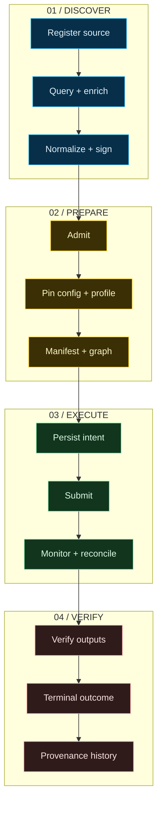

<p align="center">
  
</p>

<h1 align="center">Beampipe Core</h1>

<p align="center">
  <strong>A durable control plane for archive-driven radio astronomy workflows.</strong>
</p>

<p align="center">
  Discover scientific data, prepare reproducible manifests and DALiuGE graphs, and drive local or Slurm-backed execution without losing operational truth.
</p>

<p align="center">
  <a href="https://github.com/jbwod/beampipe-core-v2/actions/workflows/rust.yml"></a>
  <a href="https://beampipe-core.readthedocs.io/"></a>
  
  
  
</p>

<p align="center">
  <a href="https://beampipe-core.readthedocs.io/getting-started/"><strong>Start</strong></a>
  &nbsp;|&nbsp;
  <a href="https://beampipe-core.readthedocs.io/operations/"><strong>Operate</strong></a>
  &nbsp;|&nbsp;
  <a href="https://beampipe-core.readthedocs.io/project-configs/"><strong>Configure projects</strong></a>
  &nbsp;|&nbsp;
  <a href="https://beampipe-core.readthedocs.io/architecture/"><strong>Understand</strong></a>
  &nbsp;|&nbsp;
  <a href="https://beampipe-core.readthedocs.io/api/reference/"><strong>API</strong></a>
</p>

<p align="center">
  
</p>

> [!IMPORTANT]
> Beampipe is not the science workflow engine. It is the external control plane around the workflow: it records intent, versions inputs, leases side effects to workers, reconciles scheduler and DALiuGE state, and preserves enough evidence to recover after interruption.

## Why Beampipe

Archive-driven workflows cross systems that disagree, time out, restart, and report success at different moments. A successful `sbatch` call is not a running DALiuGE session, and a finished session is not verified scientific output.

Beampipe keeps those facts separate while giving operators one coherent surface.

| Beampipe owns | External systems retain |
|---|---|
| Source identity and discovery signatures | Archive metadata and product availability |
| Versioned project configuration and deployment snapshots | Facility accounts, partitions, and policy |
| Manifest, graph, translation, and run artifacts | DALiuGE graph execution |
| Admission, durable jobs, claims, leases, and fencing | Slurm allocation state |
| Retry, cancellation, provenance, diagnostics, and audit | Scientific output semantics |

## Architecture



The control-plane boundary is deliberate:

- PostgreSQL is authoritative for intent, jobs, executions, artifacts, and provenance.
- Workers perform bounded side effects under renewable leases and fencing tokens.
- CASDA, Slurm, and DALiuGE remain authorities for their own observed state.
- Reconciliation derives the next safe action when those observations disagree.

[Read the architecture map](https://beampipe-core.readthedocs.io/architecture/) or the deeper [control-plane boundary](https://beampipe-core.readthedocs.io/architecture/control-plane/).

## What ships

| Surface | Capability |
|---|---|
| `[CONFIG]` | Strict `beampipe.dev/v2` YAML/JSON with typed transforms, graph patches, automation limits, and structured diagnostics |
| `[DISCOVER]` | CASDA and VizieR TAP queries, enrichment, normalized metadata, discovery flags, and stable signatures |
| `[PREPARE]` | Immutable config/profile snapshots, manifests, patched graphs, checksums, diffs, and dry preparation |
| `[EXECUTE]` | DALiuGE translation, REST deployment, Slurm over SSH, deterministic external identity, and output verification |
| `[DISTRIBUTE]` | Worker registration, pools, capabilities, labels, concurrency limits, atomic claims, lease renewal, fencing, drain, and recovery |
| `[OPERATE]` | Guided setup, doctor checks, terminal console, timelines, safe retry/cancel, scheduler and DALiuGE inspection |
| `[OBSERVE]` | Structured failures, provenance events, health/readiness, Prometheus metrics, alerts, and OpenAPI |
| `[EXTEND]` | Typed archive/scheduler/DALiuGE adapters and optional WASM project hooks |

## Quick start

This proof path runs the real API, job system, PostgreSQL ledger, and terminal console with mock external backends. It does not contact CASDA, DALiuGE, SSH, or Slurm and cannot submit scientific work.

### 1. Put `beampipe` on `PATH`

Use a binary from [GitHub Releases](https://github.com/jbwod/beampipe-core-v2/releases), or build the current checkout:

```bash
cargo build --locked --release -p beampipe-cli --bin beampipe
export PATH="$PWD/target/release:$PATH"
```

### 2. Bootstrap a local operator environment

```bash
docker compose up -d postgres
mkdir -p operator-local
beampipe init --directory operator-local
cd operator-local
beampipe setup --yes \
  --admin-password 'replace-this-local-password' \
  --project-config ../config/wallaby_hires.v2.yaml
```

`setup` creates private local configuration, generates a JWT secret when needed, applies migrations, creates the administrator, installs a mock deployment profile, validates the project, and runs diagnostics.

### 3. Start and observe

```bash
beampipe doctor
beampipe start
```

From a second terminal in `operator-local`:

```bash
beampipe status
beampipe console
```

The API is available at `http://127.0.0.1:8080/api/v2`. Continue with the annotated [five-minute local start](https://beampipe-core.readthedocs.io/getting-started/five-minute-start/) and [first workflow](https://beampipe-core.readthedocs.io/getting-started/first-run/).

> [!CAUTION]
> Do not enable `BEAMPIPE_USE_REAL_BACKENDS=true` until deployment-profile validation, graph preparation, TLS/SSH trust, and profile-specific doctor checks pass.

## From source to verified outcome



Beampipe records several state axes because external facts can disagree:

| Axis | Representative states | Question answered |
|---|---|---|
| Control phase | `discovered`, `graph_patched`, `monitoring`, `terminal` | Where is Beampipe in its durable procedure? |
| Submission | `not_started`, `in_flight`, `submitted`, `uncertain`, `failed` | Can Beampipe prove whether submission happened? |
| Scheduler | `not_submitted`, `pending`, `running`, `succeeded`, `failed`, `unknown` | What does Slurm report? |
| DALiuGE | `not_created`, `building`, `running`, `finished`, `failed`, `unreachable` | What does the workflow runtime report? |
| Outputs | `not_started`, `verifying`, `verified`, `failed`, `unknown` | Did the expected scientific artifacts pass verification? |

An uncertain submission is fenced from retry until reconciliation proves no scheduler job or DALiuGE session exists. See the [execution state model](https://beampipe-core.readthedocs.io/architecture/state-machine/) and [recovery procedure](https://beampipe-core.readthedocs.io/operations/recovery/).

## Project config v2

Project configuration remains human-authored YAML, with a YANG-like typed shape enforced by Rust. Closed behavior uses enums; reusable transforms are named; field mappings and graph patches are validated before runtime.

This excerpt shows the typed shape; use one of the complete repository examples to start a project.

```yaml
apiVersion: beampipe.dev/v2
kind: ProjectConfig
metadata:
  id: wallaby_hires

definitions:
  transforms:
    askap_sbid:
      kind: extract_digits
    trim:
      kind: trim
    normalized_sbid:
      kind: chain
      steps: [askap_sbid, trim]

adapters:
  required: [casda, vizier]

graph:
  url: https://example.org/wallaby.graph

graph_patches:
  - match:
      kind: node_name
      equals: Scatter/GenericScatterApp/Beam
    set:
      num_of_copies: "$count(sbids[].datasets[])"
```

Validate before upload or activation:

```bash
beampipe project validate -f config/wallaby_hires.v2.yaml
```

Use the full [WALLABY HiRes configuration](config/wallaby_hires.v2.yaml), the compact [minimal survey example](config/examples/minimal_survey.v2.yaml), and the [project-config reference](https://beampipe-core.readthedocs.io/project-configs/).

## Deployment models

| Model | Process shape | Backend boundary | Best for |
|---|---|---|---|
| Compact | `beampipe start` | Mock or configured profile | Evaluation and small deployments |
| Split services | API, one scheduler-enabled process, horizontally scaled workers | Mock, REST, or Slurm | Production control-plane operation |
| REST remote | Workers translate and call a reachable DALiuGE DIM | HTTPS with explicit TLS policy | Existing DALiuGE services |
| Slurm remote | Workers translate, upload over SSH, submit with `sbatch`, poll `squeue`/`sacct` | Strict host keys plus facility profile | HPC and Setonix-style operation |

```bash
# API only
beampipe serve --worker false

# Recurring scheduler ticks
BEAMPIPE_WORKER_SCHEDULER_ENABLED=true beampipe serve --worker true

# Horizontally scalable queue workers
BEAMPIPE_WORKER_SCHEDULER_ENABLED=false BEAMPIPE_WORKER_CONCURRENCY=4 beampipe worker
```

Deployment profiles pin translator, manager, scheduler, resource, topology, TLS, and concurrency settings to each execution. Start with [deployment profiles](https://beampipe-core.readthedocs.io/architecture/deployment-profiles/) and the [DALiuGE and Setonix guide](https://beampipe-core.readthedocs.io/operations/daliuge-setonix/).

## One binary, deliberate roles

| Task | Command |
|---|---|
| Create safe configuration templates | `beampipe init` |
| Run guided setup | `beampipe setup` |
| Check configuration and live dependencies | `beampipe doctor` |
| Start a compact API and worker deployment | `beampipe start` |
| Run or inspect workers | `beampipe worker` |
| Validate and manage project YAML | `beampipe project` |
| Validate and inspect deployment profiles | `beampipe profile` |
| Prepare and compare DALiuGE graph artifacts | `beampipe graph` |
| Inspect, retry, or cancel executions | `beampipe execution` |
| Inspect scheduler and DALiuGE state | `beampipe scheduler`, `beampipe daliuge` |
| Follow durable history | `beampipe timeline` |
| Open the terminal operator interface | `beampipe console` |
| Export the API contract | `beampipe openapi export` |

Run `beampipe <command> --help` for the exact options in the installed release. The [CLI reference](https://beampipe-core.readthedocs.io/reference/cli/) groups commands by operator intent.

## Operator and API surfaces

| Surface | Entry point | Source of truth |
|---|---|---|
| Terminal console | `beampipe console` | PostgreSQL plus configured live probes |
| Queue summary | `beampipe status` | Jobs, executions, workers, and alerts |
| Timeline | `beampipe timeline execution <id> --table` | Provenance and claim history |
| HTTP API | `/api/v2` | Versioned Axum API |
| Swagger UI | `/api/v2/docs` | Generated OpenAPI |
| OpenAPI JSON | `/api/v2/openapi.json` | Generated contract |
| Health/readiness | `/api/v2/health`, `/api/v2/ready` | Process and dependency checks |
| Metrics | `/metrics` | Prometheus exposition |

The console provides Overview, Sources, Executions, Workers, Scheduler, DALiuGE, Logs, and guarded Actions views. It projects durable state; it does not invent scheduler or DALiuGE data when those systems are unavailable.

## Documentation

| Journey | Start here |
|---|---|
| Install and prove the system safely | [Choose a path](https://beampipe-core.readthedocs.io/getting-started/) |
| Run an operator shift | [Operator handbook](https://beampipe-core.readthedocs.io/operations/) |
| Author survey policy | [Project config YAML](https://beampipe-core.readthedocs.io/project-configs/) |
| Understand state and boundaries | [Architecture map](https://beampipe-core.readthedocs.io/architecture/) |
| Integrate over HTTP | [API workflow](https://beampipe-core.readthedocs.io/api/) |
| Look up exact API objects | [Generated API reference](https://beampipe-core.readthedocs.io/api/reference/) |
| Navigate every article | [Documentation map](https://beampipe-core.readthedocs.io/about/documentation-map/) |

## Repository map

| Path | Responsibility |
|---|---|
| [`crates/beampipe-cli`](crates/beampipe-cli) | Command surface, setup, doctor, and Ratatui console |
| [`crates/beampipe-api`](crates/beampipe-api) | Axum API, operator endpoints, and OpenAPI |
| [`crates/beampipe-domain`](crates/beampipe-domain) | Execution state, diagnostics, readiness, and admission |
| [`crates/beampipe-db`](crates/beampipe-db) | PostgreSQL models, repositories, claims, artifacts, and provenance |
| [`crates/beampipe-jobs`](crates/beampipe-jobs) | Scheduler ticks, worker leases, dispatch, and recovery |
| [`crates/beampipe-orchestration`](crates/beampipe-orchestration) | DALiuGE, scheduler, manifest, staging, and cancellation adapters |
| [`crates/beampipe-project`](crates/beampipe-project) | Typed project-config v2 model, transforms, and validation |
| [`crates/beampipe-profiles`](crates/beampipe-profiles) | Deployment profiles, resource models, and snapshots |
| [`migrations`](migrations) | Versioned PostgreSQL schema |
| [`boilerplate_docs`](boilerplate_docs) | MkDocs operator and engineering documentation |

## Development

```bash
cargo fmt --all -- --check
cargo clippy --workspace --all-targets -- -D warnings
cargo test --workspace --all-targets
cargo test --workspace --doc
python3 -m mkdocs build --strict
```

Regenerate the API contract after request or response changes:

```bash
beampipe openapi export > boilerplate_docs/openapi.json
```

See [Contributing](boilerplate_docs/contributing.md) for contract and documentation requirements.

---

<p align="center">
  <strong>CASDA facts. Versioned policy. Durable intent. Reconciled execution.</strong>
</p>
