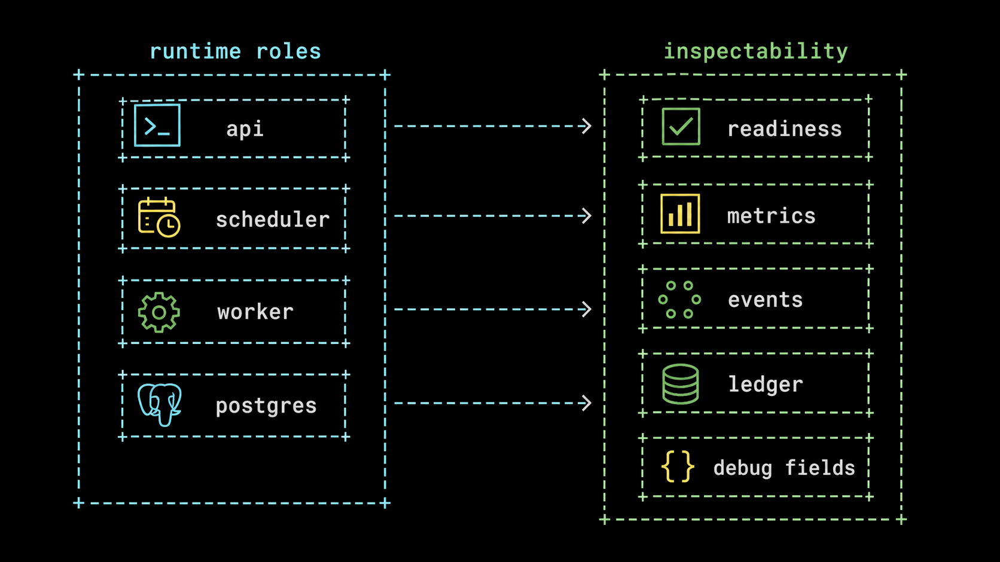

<p align="center">
  
</p>

<p align="center">
  <a href="https://github.com/jbwod/beampipe-core-v2/actions/workflows/rust.yml"></a>
  <a href="https://beampipe-core.readthedocs.io/"></a>
  
  
</p>


> `beampipe-core` is a modular orchestration and triggering framework for data-driven radio astronomy workflows. It operates as an external control plane: archive facts come from CASDA and VizieR, durable intent lives in PostgreSQL, and scheduler-aware execution of [DALiuGE](https://daliuge.icrar.org/) graphs runs on REST DIM or Slurm.


## `What it does`

> - **`Archive-driven triggering`**: discovers newly deposited datasets through project-defined TAP queries (not hardcoded SQL) and triggers processing when metadata is complete.

> - **`Idempotent execution ledger`**: records each run in PostgreSQL so retries are safe, duplicates are skipped, and incomplete work can be reconciled.

> - **`Scheduler-aware orchestration`**: submits graphs to an existing DALiuGE DIM or through SSH to Slurm, with queue and cluster constraints taken from a pinned deployment profile.

> - **`Workflow-agnostic execution`**: treats pipelines as portable DALiuGE graphs so survey policy can change without rewriting the control plane.


## `Core Module Features`

> - **`Source registry`**: register and manage astronomical sources by common-ID over the API, including bulk registration.

> - **`Run ledger enforcement`**: validates executions against registered, enabled, discovery-complete sources before any external I/O.

> - **`Trigger and schedule setup`**: polls configured archives on a project cadence. Frequency, batch size, and admission caps are policy, not code.

> - **`Direct-to-compute`**: deployment profiles select REST DIM or Slurm remote, translator settings, and compute limits per run, per project, or as globals.

<table>
  <tr>
    <td>
<picture>


</picture>
    </td>
    <td>
<picture>


</picture>
    </td>
  </tr>
</table>


## `Modular Orchestration by design`

> - **`Project-scoped automation`**: survey-agnostic YAML policy drives discovery and execution before work is enqueued. The reference config is [`wallaby_hires.v2.yaml`](config/wallaby_hires.v2.yaml) for [`wallaby-hires`](https://github.com/ICRAR/wallaby-hires), integrating CASDA ingestion with HPC compute on [Pawsey Setonix](https://pawsey.org.au/systems/setonix/).

> - **`Shaping and admission`**: global and per-project guards (rate budgets, queue depth, in-flight discovery batches / execution runs) keep automation within configured capacity.

> - **`Execution ledger (batch runs)`**: API and workers create batch records over registered sources. The ledger checks that sources are registered, enabled, discovery-complete, and backed by archive metadata (including per-source filters and discovery flags from the project) before a job is created. Each run pins a project revision and a deployment-profile snapshot.

> - **`Durable workers`**: discovery and execution run under renewable fenced leases. Intent is persisted before external I/O, external IDs are recorded as soon as they are known, and ambiguity is reconciled before retry.

> - **`DALiuGE integrated`**: translator and deployment profiles (REST DIM, Slurm remote, compute limits) can be assigned per-run, per-project, or as globals. A `beampipe-ingest` node receives the generated JSON manifest so existing graphs can be imported in [EAGLE](https://eagle.icrar.org/).

<table>
  <tr>
    <td>
<picture>


</picture>
    </td>
    <td>
      <pre><code>{
  "name": "dlg-dim",
  "project_module": "wallaby_hires",
  "is_default": true,
  "translation": {
    "algo": "metis",
    "num_par": 1,
    "num_islands": 0,
    "tm_url": "http://dlg-tm:8084"
  },
  "deployment": {
    "kind": "rest_remote",
    "dim_host_for_tm": "dlg-dim",
    "dim_port_for_tm": 8001,
    "deploy_host": "dlg-dim",
    "deploy_port": 8001
  }
}</code></pre>
    </td>
  </tr>
</table>


### `Adding a project`

Project config is immutable survey policy: source identity, TAP queries, metadata preparation, manifests, graph patches, and automation. No project query is hardcoded in the Rust worker.

```yaml
apiVersion: beampipe.dev/v2
kind: ProjectConfig
metadata: {}
definitions: {}
source_identity: {}
adapters: {}
graph: {}
discovery: {}
manifest: {}
graph_patches: []
automation: {}
extension: {}
```

```bash
beampipe project validate -f config/wallaby_hires.v2.yaml
beampipe project add -f config/wallaby_hires.v2.yaml
```

`validate` returns structured diagnostics and a canonical SHA-256. `add` stores a new immutable revision and activates it. Existing executions keep their pinned revision.


## `First-time setup`

```bash
curl -fsSL https://github.com/jbwod/beampipe-core-v2/releases/latest/download/install.sh | sh
```

That installs `beampipe` to `~/.local/bin`, writes `~/beampipe`, and starts Postgres plus the stack. Interactive setup asks Docker (default) or host, then prompts Next actions (live backends, a deployment profile, Slurm SSH credentials, CASDA credentials). Non-interactive:

```bash
curl -fsSL https://github.com/jbwod/beampipe-core-v2/releases/latest/download/install.sh | sh -s -- --yes --runtime docker
```

The API is at `http://127.0.0.1:18080/api/v2`. Files live in `~/beampipe`. You do not need to clone this repository.

Install a deployment profile with `beampipe profile add`, run `beampipe doctor --profile NAME`, then set `BEAMPIPE_USE_REAL_BACKENDS=true` and `beampipe restart`. Continue with the [quick start](https://beampipe-core.readthedocs.io/getting-started/) and [first workflow](https://beampipe-core.readthedocs.io/getting-started/first-run/).


## `Runtime`

<picture>
  <source media="(prefers-color-scheme: dark)" srcset="assets/readme/operations-observability-terminal-dark.png">
  <source media="(prefers-color-scheme: light)" srcset="assets/readme/operations-observability-terminal-transparent.png">
  
</picture>

| Role | Command | Scale rule |
|---|---|---|
| API | `beampipe serve --worker false` | scale for HTTP traffic |
| Scheduler | `BEAMPIPE_WORKER_SCHEDULER_ENABLED=true beampipe serve --worker true` | run exactly one |
| Worker | `BEAMPIPE_WORKER_SCHEDULER_ENABLED=false beampipe worker` | scale for queue throughput |
| Compact | `beampipe start` | local evaluation and small deployments |

> - Rust workspace: API/auth/config, database/domain state, project/profile schemas, adapters/orchestration, jobs, security, metrics, CLI
> - PostgreSQL as control-plane truth (sources, revisions, ledger, jobs, artifacts)
> - JWT auth for `/api/v2`
> - One-command Docker Compose or a host binary
> - REST DIM or Slurm as the execution backend; archives and schedulers keep authority over their own facts


## `Documentation`

| Task | Page |
|---|---|
| Install and reach a healthy system | [Quick start](https://beampipe-core.readthedocs.io/getting-started/) |
| Run one discovery and graph preparation | [First workflow](https://beampipe-core.readthedocs.io/getting-started/first-run/) |
| Author project-defined TAP and graph policy | [Project YAML](https://beampipe-core.readthedocs.io/project-configs/) |
| Integrate over HTTP | [API workflow](https://beampipe-core.readthedocs.io/api/) |
| Operate and recover work | [Operator handbook](https://beampipe-core.readthedocs.io/operations/) |

## `Development`

```bash
cargo fmt --all -- --check
cargo clippy --workspace --all-targets -- -D warnings
cargo test --workspace --all-targets
beampipe project validate -f config/wallaby_hires.v2.yaml
make docs-build
```

See the [architecture](https://beampipe-core.readthedocs.io/architecture/) for crate ownership boundaries.
