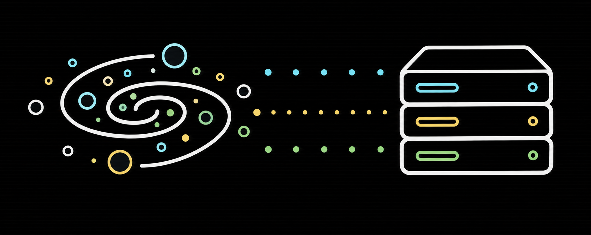
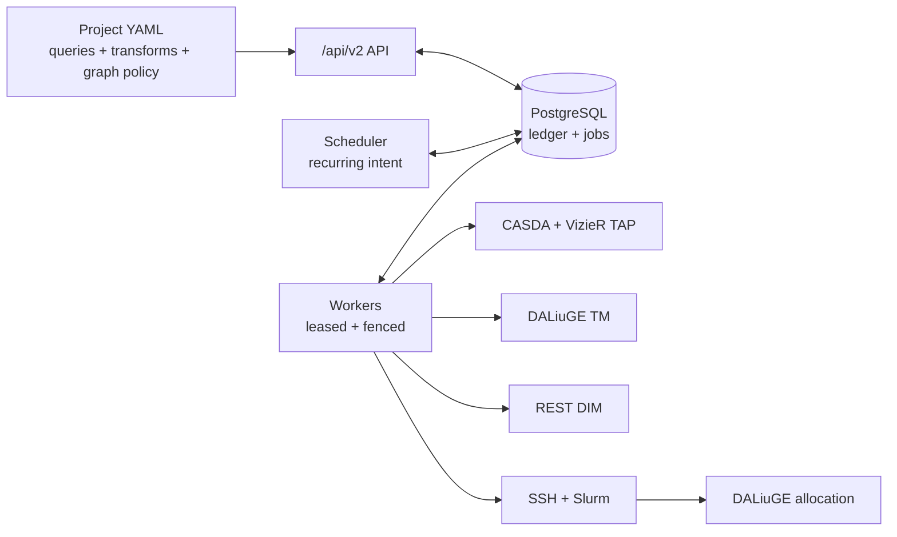
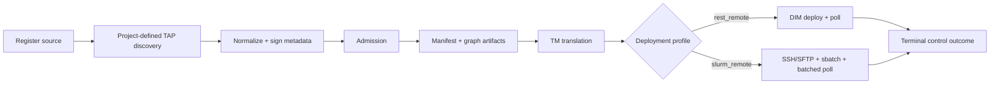

<p align="center">
  
</p>

<h1 align="center">Beampipe Core</h1>

<p align="center"><strong>A durable Rust control plane for archive-driven DALiuGE workflows.</strong></p>

<p align="center">
  <a href="https://github.com/jbwod/beampipe-core-v2/actions/workflows/rust.yml"></a>
  <a href="https://beampipe-core.readthedocs.io/"></a>
  
  
</p>

Beampipe turns project-defined archive discovery into reproducible manifests and DALiuGE graphs, then operates execution through an existing DIM or Slurm. PostgreSQL preserves intent, jobs, claims, artifacts, external observations, and provenance across process restarts.

> [!IMPORTANT]
> Beampipe is not the science workflow engine. CASDA, Slurm, and DALiuGE remain authoritative for archive facts, allocations, and graph execution.

## Architecture


```mermaid
flowchart LR
    POLICY["Project YAML<br/>queries + transforms + graph policy"] --> API["/api/v2 API"]
    API <--> DB[("PostgreSQL<br/>ledger + jobs")]
    SCHED["Scheduler<br/>recurring intent"] <--> DB
    WORKERS["Workers<br/>leased + fenced"] <--> DB
    WORKERS --> TAP["CASDA + VizieR TAP"]
    WORKERS --> TM["DALiuGE TM"]
    WORKERS --> DIM["REST DIM"]
    WORKERS --> SSH["SSH + Slurm"]
    SSH --> RUNTIME["DALiuGE allocation"]
```

The key invariant is simple: persist deterministic intent before external I/O, record external IDs as soon as they are known, and reconcile ambiguity before retrying.

## Quick start

```bash
curl -fsSL https://github.com/jbwod/beampipe-core-v2/releases/latest/download/install.sh | sh
```

That installs `beampipe` to `~/.local/bin`, writes `~/beampipe`, and starts Postgres plus the stack. Interactive setup asks Docker (default) or host. Non-interactive:

```bash
curl -fsSL https://github.com/jbwod/beampipe-core-v2/releases/latest/download/install.sh | sh -s -- --yes --runtime docker
```

The API is at `http://127.0.0.1:8080/api/v2`. Files live in `~/beampipe`. You do not need to clone this repository. Linux host archives need glibc and OpenSSL 3 (Ubuntu 22.04 / Debian bookworm or newer).

`--no-start` writes files and prints a recipe without starting anything. A source build is only for qualifying a commit and needs Cargo 1.78 or newer.

Use an override to bind API, metrics, and PostgreSQL to loopback on a workstation.
When Dash is also containerized, attach it to the Core Compose network and use
`http://api:8080`; the browser never needs direct API access.

See [deployment topologies](https://beampipe-core.readthedocs.io/getting-started/deployment/)
for secure bindings, Docker contexts, role configuration, system services,
container platforms, REST/DIM, and Slurm.

Install a deployment profile with `beampipe profile add` before setting `BEAMPIPE_USE_REAL_BACKENDS=true`.

Continue with the [quick start](https://beampipe-core.readthedocs.io/getting-started/) and [first workflow](https://beampipe-core.readthedocs.io/getting-started/first-run/).

## Workflow


```mermaid
flowchart LR
    A["Register source"] --> B["Project-defined TAP discovery"]
    B --> C["Normalize + sign metadata"]
    C --> D["Admission"]
    D --> E["Manifest + graph artifacts"]
    E --> F["TM translation"]
    F --> G{"Deployment profile"}
    G -->|rest_remote| H["DIM deploy + poll"]
    G -->|slurm_remote| I["SSH/SFTP + sbatch + batched poll"]
    H --> J["Terminal control outcome"]
    I --> J
```

Project-specific ADQL, enrichments, metadata mappings, signatures, manifests, and graph patches live in immutable `beampipe.dev/v2` YAML. They are not hardcoded in the workers.

## Runtime roles

| Role | Command | Scale rule |
|---|---|---|
| API | `beampipe serve --worker false` | scale for HTTP traffic |
| Scheduler | `BEAMPIPE_WORKER_SCHEDULER_ENABLED=true beampipe serve --worker true` | run exactly one |
| Worker | `BEAMPIPE_WORKER_SCHEDULER_ENABLED=false beampipe worker` | scale for queue throughput |
| Compact | `beampipe start` | local evaluation and small deployments |

## Current qualification

The current code has been exercised through archive discovery, manifest and graph preparation, DALiuGE translation, and REST deployment to a local cluster. A 2026-08-13 no-stage/no-download qualification reached a consistent terminal `succeeded` outcome: both DALiuGE node managers finished and reported zero error drops after the WALLABY list/pickle graph contract was aligned.

That result establishes local control-plane Q0-Q3 for the pinned REST profile and graph/runtime combination. It does not establish CASDA authenticated staging, Slurm execution, or scientific-product verification. VizieR was unavailable during that particular rerun, so its execution used a narrowly scoped pinned catalog fallback rather than being presented as fresh live-VizieR evidence.

The output state axis is implemented, but no worker currently verifies scientific products. Runtime completion must not be described as native scientific-output verification.

See the [qualification run](https://beampipe-core.readthedocs.io/operations/end-to-end-demo/) for exact evidence and remaining gates.

## Documentation

| Task | Page |
|---|---|
| Install and reach a healthy system | [Quick start](https://beampipe-core.readthedocs.io/getting-started/) |
| Choose Docker, native, system-service, or orchestrated deployment | [Deployment topologies](https://beampipe-core.readthedocs.io/getting-started/deployment/) |
| Run one discovery and graph preparation | [First workflow](https://beampipe-core.readthedocs.io/getting-started/first-run/) |
| Demonstrate multiple no-download REST runs | [REST demonstration playbook](https://beampipe-core.readthedocs.io/getting-started/rest-no-downloads-demo/) |
| Connect REST or Slurm and manage SSH keys | [Deployment profiles and SSH](https://beampipe-core.readthedocs.io/architecture/deployment-profiles/) |
| Operate and recover work | [Operator handbook](https://beampipe-core.readthedocs.io/operations/) |
| Author project-defined TAP and graph policy | [Project YAML](https://beampipe-core.readthedocs.io/project-configs/) |
| Integrate over HTTP | [API workflow](https://beampipe-core.readthedocs.io/api/) |

## Development

```bash
cargo fmt --all -- --check
cargo clippy --workspace --all-targets -- -D warnings
cargo test --workspace --all-targets
beampipe project validate -f config/wallaby_hires.v2.yaml
make docs-build
```

The workspace crates separate API/auth/config, database/domain state, project/profile schemas, adapters/orchestration, jobs, security, metrics/alerts, and the CLI. See the [architecture](https://beampipe-core.readthedocs.io/architecture/) for ownership boundaries.
