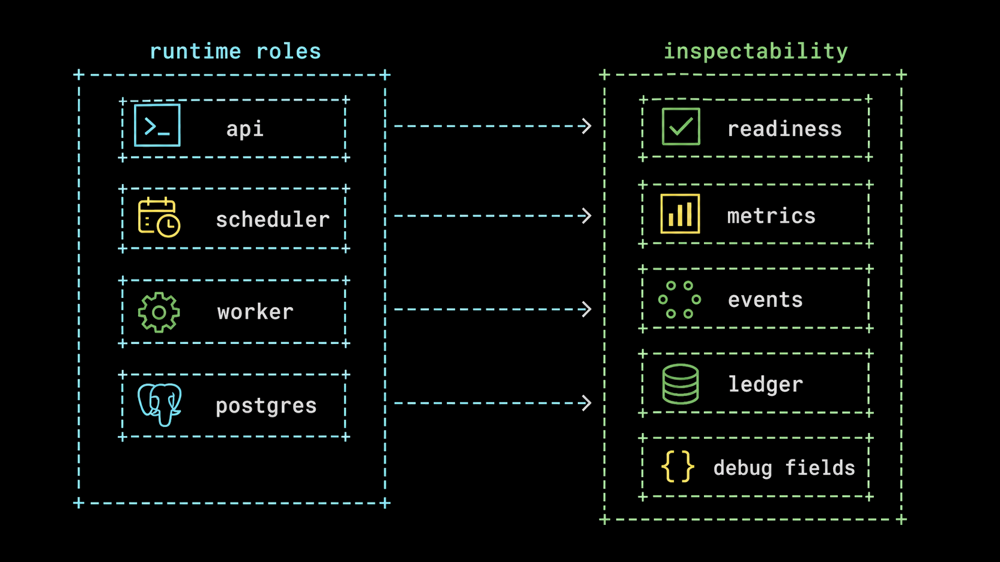

<p align="center">
  
</p>

<p align="center">
  <a href="https://github.com/jbwod/beampipe-core-v2/actions/workflows/rust.yml"></a>
  <a href="https://beampipe.jackblackwood.com/"></a>
  
  
</p>


> `beampipe-core` is a modular orchestration and triggering framework for data-driven workflows. It operates as an external control plane: project adapters supply catalog facts, durable intent lives in PostgreSQL, and scheduler-aware execution of [DALiuGE](https://daliuge.icrar.org/) graphs runs on REST DIM or Slurm.


## `What it does`

> - **`Archive-driven triggering`**: discovers new records through project-defined TAP endpoints and queries, then triggers processing when configured metadata is complete.

> - **`Idempotent execution ledger`**: records each run in PostgreSQL so retries are safe, duplicates are skipped, and incomplete work can be reconciled.

> - **`Scheduler-aware orchestration`**: submits graphs to an existing DALiuGE DIM or through SSH to Slurm, with queue and cluster constraints taken from a pinned deployment profile.

> - **`Workflow-agnostic execution`**: treats pipelines as portable DALiuGE graphs so survey policy can change without rewriting the control plane.


## `Core Module Features`

> - **`Source registry`**: register and manage project source identifiers over the API, including bulk registration.

> - **`Run ledger enforcement`**: validates executions against registered, enabled, discovery-complete sources before any external I/O.

> - **`Trigger and schedule setup`**: polls configured archives on a project cadence. Frequency, batch size, and admission caps are policy, not code.

> - **`Direct-to-compute`**: deployment profiles select REST DIM or Slurm remote, translator settings, and compute limits per run, per project, or as globals.

<table>
  <tr>
    <td>
<picture>


</picture>
    </td>
    <td>
<picture>


</picture>
    </td>
  </tr>
</table>


## `Modular Orchestration by design`

> - **`Project-scoped automation`**: project-neutral YAML policy drives discovery and execution before work is enqueued. Start with [`minimal_survey.v2.yaml`](config/examples/minimal_survey.v2.yaml). [`wallaby_hires.v2.yaml`](config/wallaby_hires.v2.yaml) is an explicit first-party provider sample integrating CASDA ingestion with [`wallaby-hires`](https://github.com/ICRAR/wallaby-hires) on [Pawsey Setonix](https://pawsey.org.au/systems/setonix/).

> - **`Shaping and admission`**: global and per-project guards (rate budgets, queue depth, in-flight discovery batches / execution runs) keep automation within configured capacity.

> - **`Execution ledger (batch runs)`**: API and workers create batch records over registered sources. The ledger checks that sources are registered, enabled, discovery-complete, and backed by archive metadata (including per-source filters and discovery flags from the project) before a job is created. Each run pins a project revision and a deployment-profile snapshot.

> - **`Durable workers`**: discovery and execution run under renewable fenced leases. Intent is persisted before external I/O, external IDs are recorded as soon as they are known, and ambiguity is reconciled before retry.

> - **`DALiuGE integrated`**: translator and deployment profiles (REST DIM, Slurm remote, compute limits) can be assigned per-run, per-project, or as globals. A `beampipe-ingest` node receives the generated JSON manifest so existing graphs can be imported in [EAGLE](https://eagle.icrar.org/).

<table>
  <tr>
    <td>
<picture>


</picture>
    </td>
    <td>
      <pre><code>{
  "name": "dlg-dim",
  "project_module": "minimal_survey",
  "is_default": true,
  "translation": {
    "algo": "metis",
    "num_par": 1,
    "num_islands": 0,
    "tm_url": "http://dlg-tm:8084"
  },
  "deployment": {
    "kind": "rest_remote",
    "dim_host_for_tm": "dlg-dim",
    "dim_port_for_tm": 8001,
    "deploy_host": "dlg-dim",
    "deploy_port": 8001
  }
}</code></pre>
    </td>
  </tr>
</table>


### `Adding a project`

Project config is immutable workflow policy: source identity, named TAP endpoints and queries, metadata preparation, staging provider, manifests, graph patches, output verification, and automation. No project query is hardcoded in the Rust worker.

```yaml
apiVersion: beampipe.dev/v2
kind: ProjectConfig
metadata: {}
definitions: {}
source_identity: {}
adapters: {}
staging: {}
graph: {}
discovery: {}
manifest: {}
graph_patches: []
output_verification: {}
automation: {}
extension: {}
```

```bash
beampipe project validate -f config/examples/minimal_survey.v2.yaml
beampipe project add -f config/examples/minimal_survey.v2.yaml
```

`validate` returns structured diagnostics and a canonical SHA-256. `add` stores a new immutable revision and activates it. Existing executions keep their pinned revision.


## `First-time setup`

The recommended path is an interactive Docker wizard. It checks the host, verifies the downloaded release, and explains its choices before writing the operator bundle:

```bash
curl -fsSL https://github.com/jbwod/beampipe-core-v2/releases/latest/download/install.sh | sh
```

```text
[1/3] Check this machine
[2/3] Download and install
[3/3] Configure Beampipe
```

That installs `beampipe` to `~/.local/bin`, writes a project-neutral operator bundle to `~/beampipe`, and, for the recommended Docker path, starts PostgreSQL plus Core automatically. It creates private random secrets and keeps external execution mocked. Host mode instead prints the foreground start command. Verify the Docker result from a new terminal:

```bash
beampipe status
beampipe doctor
curl -fsS http://127.0.0.1:18080/api/v2/health
```

If you selected a custom install home, keep it explicit: `beampipe --home '/custom/install path' status` and `beampipe --home '/custom/install path' doctor`.

Headless installation requires explicit unattended intent and runtime selection:

```bash
curl -fsSL https://github.com/jbwod/beampipe-core-v2/releases/latest/download/install.sh | sh -s -- --yes --runtime docker
```

No project is installed implicitly. Supply your own config with `--project-config PATH`, or explicitly install the first-party WALLABY HiRes sample. The [interactive installer builder](https://beampipe.jackblackwood.com/#install-builder) produces either command without placing a password in it:

```bash
curl -fsSL https://github.com/jbwod/beampipe-core-v2/releases/latest/download/install.sh \
  | sh -s -- --yes --runtime docker --sample wallaby-hires
```

The API is at `http://127.0.0.1:18080/api/v2`. Files live in `~/beampipe`. You do not need to clone this repository.

Install a deployment profile with `beampipe profile add`, run `beampipe doctor --profile NAME`, then set `BEAMPIPE_USE_REAL_BACKENDS=true` and `beampipe restart`. Continue with the [quick start](https://beampipe.jackblackwood.com/getting-started/) and [project-neutral acceptance](https://beampipe.jackblackwood.com/getting-started/neutral-project/). The [WALLABY first workflow](https://beampipe.jackblackwood.com/getting-started/first-run/) applies after explicitly installing that sample.


## `Runtime`

<picture>
  <source media="(prefers-color-scheme: dark)" srcset="assets/readme/operations-observability-terminal-dark.png">
  <source media="(prefers-color-scheme: light)" srcset="assets/readme/operations-observability-terminal-transparent.png">
  
</picture>

| Role | Command | Scale rule |
|---|---|---|
| API | `beampipe serve --worker false` | scale for HTTP traffic |
| Scheduler | `BEAMPIPE_WORKER_SCHEDULER_ENABLED=true beampipe serve --worker true` | run exactly one |
| Worker | `BEAMPIPE_WORKER_SCHEDULER_ENABLED=false beampipe worker` | scale for queue throughput |
| Compact | `beampipe start` | local evaluation and small deployments |

> - Rust workspace: API/auth/config, database/domain state, project/profile schemas, adapters/orchestration, jobs, security, metrics, CLI
> - PostgreSQL as control-plane truth (sources, revisions, ledger, jobs, artifacts)
> - JWT auth for `/api/v2`
> - One-command Docker Compose or a host binary
> - REST DIM or Slurm as the execution backend; archives and schedulers keep authority over their own facts


## `Documentation`

| Task | Page |
|---|---|
| Review release changes and upgrade notes | [Changelog](CHANGELOG.md) |
| Install and reach a healthy system | [Quick start](https://beampipe.jackblackwood.com/getting-started/) |
| Prove the project-neutral Core contract offline | [Project-neutral acceptance](https://beampipe.jackblackwood.com/getting-started/neutral-project/) |
| Run WALLABY discovery and graph preparation | [WALLABY first workflow](https://beampipe.jackblackwood.com/getting-started/first-run/) |
| Qualify WALLABY with real local DALiuGE | [WALLABY local DALiuGE](https://beampipe.jackblackwood.com/getting-started/local-daliuge/) |
| Install and operate the web console | [Dashboard setup](https://beampipe.jackblackwood.com/getting-started/dashboard/) |
| Author project-defined TAP and graph policy | [Project YAML](https://beampipe.jackblackwood.com/project-configs/) |
| Integrate over HTTP | [API workflow](https://beampipe.jackblackwood.com/api/) |
| Operate and recover work | [Operator handbook](https://beampipe.jackblackwood.com/operations/) |

## `Development`

```bash
cargo fmt --all -- --check
cargo clippy --workspace --all-targets -- -D warnings
cargo test --workspace --all-targets
beampipe project validate -f config/examples/minimal_survey.v2.yaml
cargo test -p beampipe-jobs tests::neutral_project_runs_offline_end_to_end -- --exact
make docs-build
```

See the [operator docs](https://beampipe.jackblackwood.com/) and [contributing guide](https://beampipe.jackblackwood.com/contributing/).
