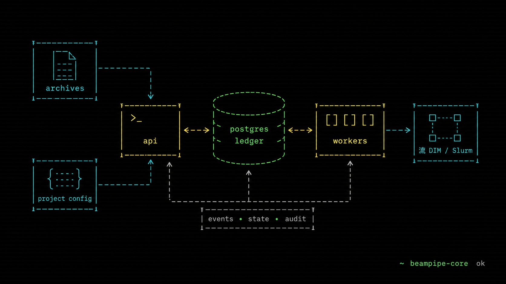

# Control plane architecture

beampipe-core coordinates archive discovery and execution state. It prepares manifests, calls translation/deployment services, and records what happened; it does not run the science graph itself.

## System shape

## Responsibilities

| Area | Responsibility |
|------|----------------|
| API | Auth, source registry, executions, project configs, profiles, alerts |
| Database | Active configs, source state, archive metadata, jobs, execution ledger, provenance |
| Worker | Scheduler ticks, TAP discovery, manifest build, staging, submit, polling |
| Project config | Survey queries, transforms, manifest shape, DALiuGE Graphs, automation |
| Deployment profile | DALiuGE translation and REST/Slurm deployment settings |

## State boundaries

Project configs are versioned. Active executions pin the config version used to build their run. Execution records keep manifest and run-record state so operators can inspect exact inputs and backend transitions after completion.

## API contract

The Rust API exposes `/api/v2` and exports OpenAPI from `utoipa`. Use [Redoc reference](../api/reference.md) for schema details and [API workflow guide](../api/index.md) for operational request order.

Next: follow [Discovery and execution lifecycle](lifecycle.md).
