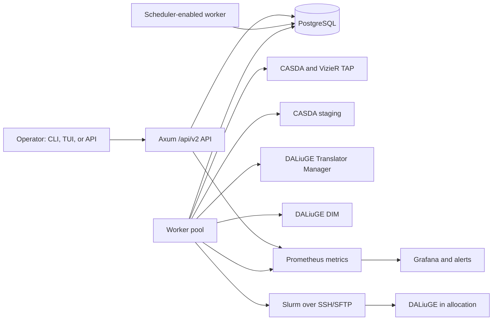

# Current system audit

This document is a code-grounded map of Beampipe Core v2 as audited on
2026-08-11 at Git commit `d070063`. It describes the Rust system in this
repository. The untracked `beampipe-core/` legacy snapshot is not part of the
runtime or this assessment.

## Executive assessment

Beampipe v2 is a substantial, coherent control plane rather than a thin API
rewrite. PostgreSQL is the source of truth for source discovery, execution
state, work queues, worker leases, immutable configuration revisions,
artifacts, and provenance. The API records operator intent; workers own
external effects; project YAML supplies survey-specific discovery and graph
policy; deployment profiles supply facility-specific execution policy.

The strongest implementation areas are:

- leased and fenced PostgreSQL jobs with worker identity, pools, labels, and
  capability routing;
- typed, dynamically loaded project configuration for TAP queries, metadata
  preparation, signatures, manifests, graph patches, and automation;
- independent submission, scheduler, DALiuGE, and output state axes instead of
  one overloaded status value;
- pinned project revisions, deployment-profile snapshots, checksummed
  artifacts, run records, and provenance events;
- production-oriented authentication, external secret references, redaction,
  SSH credential policy, metrics, alerts, diagnostics, and operator commands.

The implementation can exercise real TAP, CASDA staging, DALiuGE REST, and
Slurm paths. A repeatable demonstration still needs a few explicit completion
items, assessed in [Demo readiness](../operations/demo-readiness.md).

## Runtime architecture



The supported process roles are deliberately separable:

| Role | Command | Responsibility |
|---|---|---|
| API only | `beampipe serve --worker false` | HTTP, authentication, read models, and operator intent |
| Scheduler | `beampipe serve --worker true` | API plus recurring scheduling and a small worker pool |
| Worker only | `beampipe worker` | Claim and execute durable jobs |
| Operator | `beampipe console`, `status`, `doctor`, and resource commands | Inspect and operate the same durable state |

Only one scheduler-enabled replica should create recurring ticks. Worker-only
replicas can scale horizontally because claims use leases, fencing tokens, and
`FOR UPDATE SKIP LOCKED` semantics.

## Workspace ownership

| Crate | Primary responsibility |
|---|---|
| `beampipe-api` | Axum routes, auth boundaries, OpenAPI, operator read models |
| `beampipe-auth` | Password hashing and JWT lifecycle |
| `beampipe-config` | Layered file/environment settings and production policy |
| `beampipe-db` | SQLx models, migrations, repositories, claims, artifacts, provenance |
| `beampipe-domain` | Ledger transitions, readiness, reconciliation, admission, run-record merges |
| `beampipe-project` | Versioned project schema, validation, transforms, query and manifest policy |
| `beampipe-adapters` | TAP protocol, row parsing, retries, and health probes |
| `beampipe-orchestration` | Staging, graph preparation, TM/DIM, Slurm, SSH/SFTP, cancellation |
| `beampipe-profiles` | Typed `rest_remote` and `slurm_remote` deployment profiles |
| `beampipe-jobs` | Worker lifecycle, durable dispatch, scheduler ticks, discovery, execute and poll jobs |
| `beampipe-security` | Secret references, environment policy, and recursive redaction |
| `beampipe-metrics` | Prometheus instruments and tracing helpers |
| `beampipe-alerts` | Alert evaluation and notification delivery |
| `beampipe-cli` | Server entry point, setup, doctor, administration, graph/backend tools, TUI |

No Python subprocess, sidecar, Redis queue, or Restate bridge is required by
the v2 execution path. Redis is optional and used for distributed login rate
limiting when configured.

## Durable data model

Eight SQLx migrations currently define the control-plane schema. The important
record groups are:

| Record group | Purpose |
|---|---|
| Users and token blacklist | API identity and revoked session state |
| Source registry | Stable project/source identity, discovery timestamps, signatures, and claims |
| Archive metadata | Normalized per-source, per-SBID metadata snapshots |
| Execution ledger | Current status, phase, external axes, backend IDs, errors, timestamps, and pinned config |
| Deployment profiles | Typed backend configuration with revisions and concurrency limits |
| Project configs and WASM | Immutable project revisions and optional controlled extensions |
| Jobs, workers, and leases | PostgreSQL work queue, routing, ownership, retries, and recovery |
| Artifacts and provenance | Checksummed execution inputs and append-oriented operational history |
| Alerts and notifications | Operator alert policy and redacted delivery records |

Executions pin the active project-config UUID and, when resolved, a deployment
profile at creation. Generated manifest, source graph, and patched graph are
persisted as content-addressed artifacts before submission proceeds. Explicit
unknown profile names are a demo-readiness validation gap.

## Configuration model

Application settings load from defaults, an optional `beampipe.yaml`, `.env`,
and environment variables. The CLI reports effective values with source
information while redacting sensitive material.

Project behavior is not compiled into the worker. The active
`beampipe.dev/v2` project document defines:

- TAP adapter names, endpoints or endpoint fallbacks, timeout, retry, and
  fail-open policy;
- project-specific ADQL query and enrichment templates;
- source transforms, metadata field mappings, discovery flags, and signature
  exclusions;
- manifest grouping, values, path, and graph patch expressions;
- execution automation thresholds and the deployment-profile name.

`config/wallaby_hires.v2.yaml` is the reference contract. Its TAP queries are
data, loaded as an immutable project revision, not Rust constants.

Deployment profiles independently define translation and execution. A
`rest_remote` profile targets an existing DALiuGE manager. A `slurm_remote`
profile defines login, account, resource, DALiuGE installation, manager
topology, and remote-path policy. SSH private keys and passphrases are never
profile fields; workers resolve them from environment or mounted files.

## Discovery path

1. An operator registers an enabled source under a project ID.
2. `POST /api/v2/sources/discover` marks selected sources stale and clears
   expired claims.
3. `scheduler_tick` applies project policy, TAP health, queue-depth, stale-age,
   and batch limits.
4. The repository claims source rows with expiring ownership tokens and
   enqueues idempotent `discover_batch` jobs.
5. `ConfigDiscoveryRunner` loads the active project revision, renders its query
   templates, calls configured TAP clients, applies enrichments and transforms,
   validates prepared datasets, and computes a canonical signature.
6. Claim-guarded persistence writes a complete changed snapshot, removes stale
   SBIDs, or records a no-datasets sentinel. Unchanged discovery avoids metadata
   rewrites. Changed sources become workflow-pending.

The production worker always constructs `ConfigDiscoveryRunner`. The
`DeterministicDiscoveryRunner` is test-only behavior and returns no datasets.

## Admission and execution path

`execution_scheduler_tick` claims workflow-pending sources and applies typed
automation policy: enabled state, source/run limits, minimum batch and wait
thresholds, project/global in-flight caps, profile concurrency, queue depth,
and pacing. Explicit API execution follows the same durable ledger and worker
path after readiness validation.

An `execute` job then:

1. resolves the pinned project revision and selected deployment profile;
2. optionally stages CASDA datasets and excludes failed SBIDs while usable data
   remains;
3. builds and persists the manifest;
4. resolves the source graph, injects the manifest, applies graph patches, and
   persists source and patched graph artifacts;
5. records submission intent before contacting an external backend;
6. translates through DALiuGE TM and deploys to DIM or stages/submits a Slurm
   job over SSH/SFTP;
7. persists scheduler and DALiuGE identifiers as soon as they are observed;
8. lets recurring DIM or Slurm poll jobs reconcile independent external axes.

With `do_submit=false`, preparation stops at `not_submitted` after writing the
manifest and graph artifacts. With `BEAMPIPE_USE_REAL_BACKENDS=false`, execution
clients are mocked, but discovery still uses configured TAP services.

## State and recovery model

The ledger separates these facts:

- control phase;
- submission state;
- scheduler state and raw reason;
- DALiuGE state and raw status;
- output state;
- derived execution status and terminal outcome.

The reducer detects inconsistent observations, such as a finished scheduler
allocation while DALiuGE still reports an active session. Submission failures
after an external call can become `uncertain`, preventing an unsafe automatic
repeat. Terminal transitions are locked, retries reset external identifiers,
and cancellation is delegated to the selected backend when an external ID
exists.

Workers renew leases during long I/O. Repository updates require the current
lease/fencing token, so a stale worker cannot commit after another worker has
recovered the job. Idempotency keys cover recurring ticks, discovery claims,
execution submission, and poll work.

## Operator and security surfaces

The `/api/v2` surface includes health/readiness, diagnostics and overview,
authentication, sources and metadata, executions and artifacts, project
configs, profiles, jobs, workers and leases, scheduler/DALiuGE inspection,
alerts, notifications, and provenance.

Operational commands expose the same model through `setup`, `doctor`,
`security check`, `profile`, `scheduler`, `daliuge`, `execution`, `graph`,
`timeline`, `status`, and `console`. `doctor --profile <name>` checks the
database, migrations, security policy, optional Redis, TAP services, workers,
projects, graph access, translator/manager compatibility, SSH credentials,
Slurm connectivity, and remote directory writability as applicable.

Production policy rejects weak JWT settings, unsafe inline secrets, permissive
SSH host-key handling, unsafe key files, and other insecure defaults. Public
responses and stored external errors pass through shared redaction. Prometheus
metrics, structured tracing, alert rules, and notification channels cover the
principal API, queue, worker, discovery, execution, dependency, and security
signals. Grafana packaging remains a demo-readiness gap.

## Verification performed

The audit used source inspection across all crates, migrations, Compose files,
reference configuration, CLI/API documentation, tests, and CI definitions.
The following commands passed in the audit environment:

```text
cargo test --workspace --lib
cargo run -q -p beampipe-cli --bin beampipe -- \
  project validate -f config/wallaby_hires.v2.yaml
```

The library run covered 159 tests across adapters, alerts, API, auth, config,
database unit behavior, domain, jobs, metrics, orchestration, profiles, project
configuration, and security. The reference project validated with no errors
and SHA-256
`5f07ce58dd3755c9de1d34447cc4a9b2e77805fdff06f340424cde794eb40a88`.

The repository CI additionally runs formatting, clippy with warnings denied,
idempotent migration smoke tests, Prometheus alert-rule tests, and the full
workspace suite against PostgreSQL 16. Those database-backed and container
checks were not reproduced locally during this audit because neither Docker
nor a PostgreSQL client/server was available in the audit environment. This
limitation is recorded as unverified evidence, not as a product failure.

## Audit boundaries

This audit establishes what the repository implements and how its components
connect. It does not claim successful access to live CASDA, VizieR, TM, DIM,
Setonix, or scientific output storage. A full demonstration must prove those
contracts with controlled credentials and a known source. See
[Demo readiness](../operations/demo-readiness.md) for the remaining gaps.
