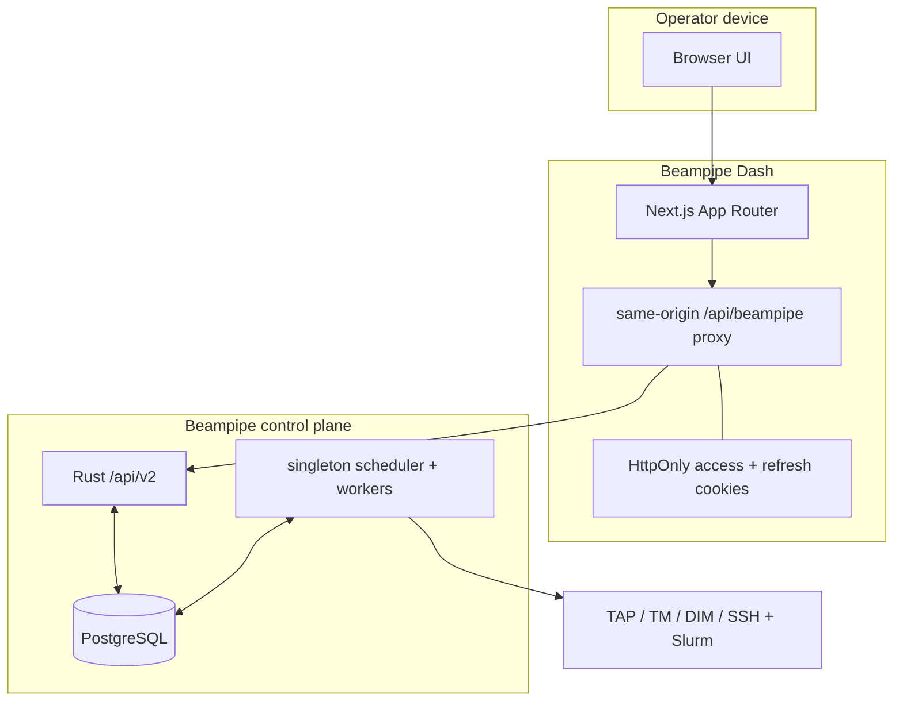
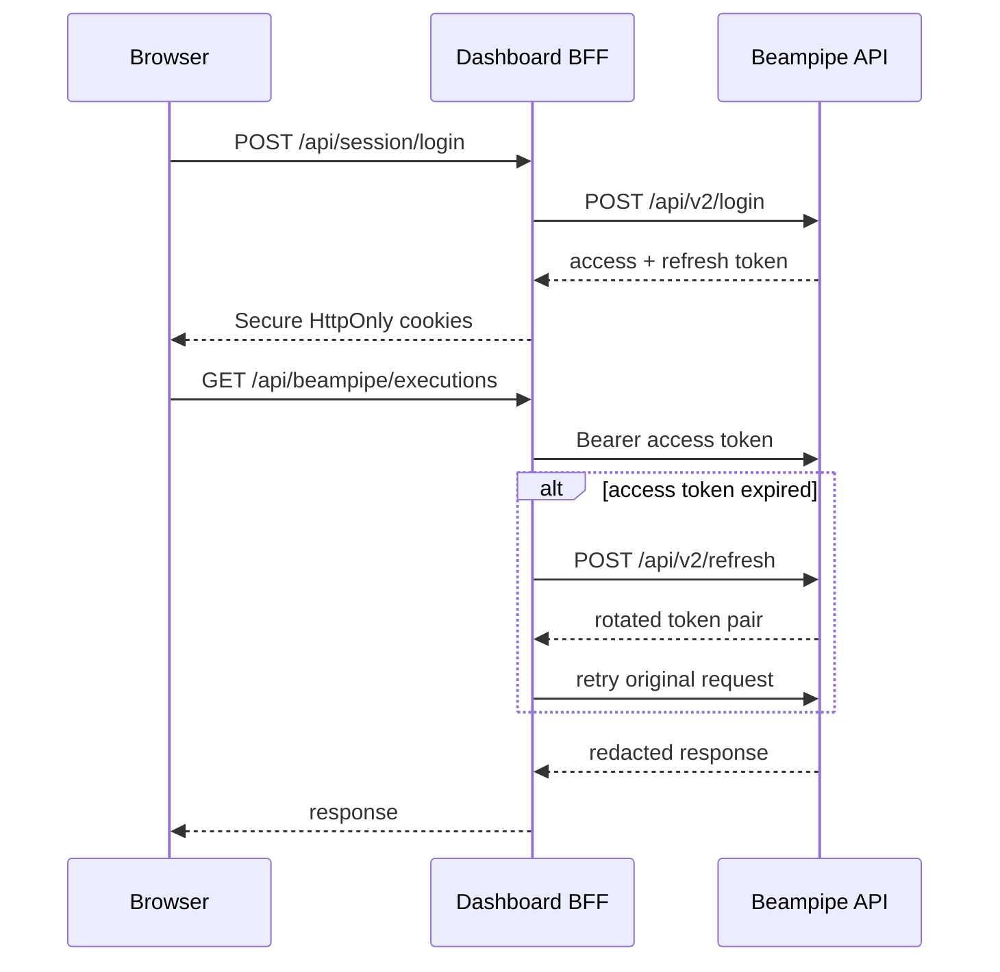

# Dashboard boundary and architecture

Beampipe Dash is an authenticated operator client, not a second control plane.
It owns no database, scheduler, worker, credential store, or workflow state.
Every displayed value and mutation maps to Core `/api/v2`; PostgreSQL remains
the durable ledger.

## Authentication boundary

The generic proxy accepts only `/api/v2/*`, discards caller-supplied
`Authorization` headers, rejects cross-origin mutations, and never exposes
either token to client JavaScript. Refresh requests are coalesced within one
Dash process. Until refresh coordination uses a shared store, run one Dash
replica or configure sticky affinity so one browser session stays on one
replica.

## Data ownership

| Data | Authority | Dashboard responsibility |
|---|---|---|
| Users and password hashes | Core | Login and current-user lookup only |
| Project configurations | Core immutable revisions | Visual/YAML authoring and upload |
| Deployment profiles | Core revisioned rows | Typed REST/Slurm editing and connectivity checks |
| Sources and archive metadata | Core | Registry, discovery trigger, and readiness inspection |
| Jobs and worker leases | Core | Bounded polling and privileged scheduler actions |
| Executions and artifacts | Core ledger | Prepare, create, start, retry, cancel, and inspect |
| SSH keys and external secrets | Core runtime | Readiness metadata only; never accepted or stored |

## Project studio contract

YAML is canonical. The visual editor and code surface operate on one parsed
`ProjectConfig` draft:

1. A visual edit updates the in-memory draft and serialized YAML.
2. Valid YAML immediately normalizes the visual draft.
3. Invalid YAML remains visible while the last valid visual draft is preserved.
4. Unknown project-specific keys survive normalization and round trips.
5. Saving uploads a new immutable revision and displays Core diagnostics.

TAP queries remain project-defined. Dash does not hardcode CASDA or VizieR
ADQL, duplicate source readiness rules, or infer backend transitions.

## Runtime behavior

- Live views poll at bounded 5–30 second intervals.
- Terminal execution detail stops automatic polling; use manual refresh for a
  deliberate re-read.
- Mutations invalidate related views rather than clearing all cached state.
- Execution preparation is authoritative and any changed selection invalidates
  the previous preview.
- Deployment forms mirror Core's tagged REST/Slurm profile schema.
- Destructive or externally effective operations require confirmation or an
  explicit review step.
- An ambiguous run-creation response is frozen with the same idempotency key;
  retrying never silently creates a second operator intent.

## Interface map

| Route | Purpose |
|---|---|
| `/overview` | Dependency state, API traffic, queue, workers, latest runs, launchpad |
| `/projects` and `/projects/new` | Project registry and bidirectional visual/YAML studio |
| `/profiles` | REST/Slurm profiles, revisions, resources, and connectivity |
| `/sources` and `/sources/:id` | Registration, discovery, admission, metadata, provenance |
| `/runs/new` | Multi-source preparation, profile pinning, creation, submission |
| `/runs` and `/runs/:id` | Live/history list and execution evidence explorer |
| `/jobs` | Durable queue, attempts, leases, and errors |
| `/workers` | Worker pools, capabilities, health, and active leases |
| `/alerts` | Core notification channels, rules, tests, and redacted deliveries |
| `/system` | Readiness, diagnostics, reconciliation risk, and SSH posture |

User creation remains a Core CLI bootstrap operation because `/api/v2` does
not expose user administration. Dash deliberately does not create a competing
credential store.
