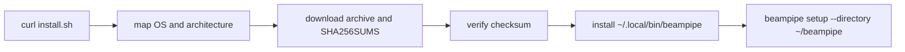
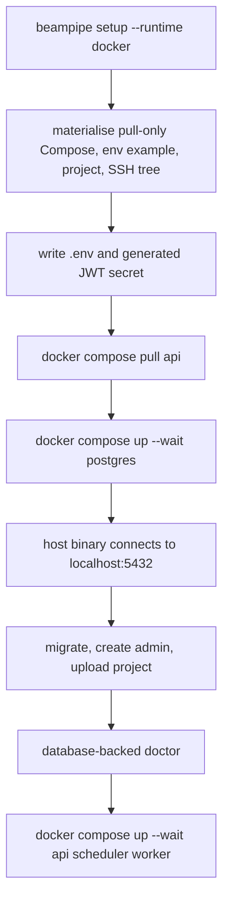
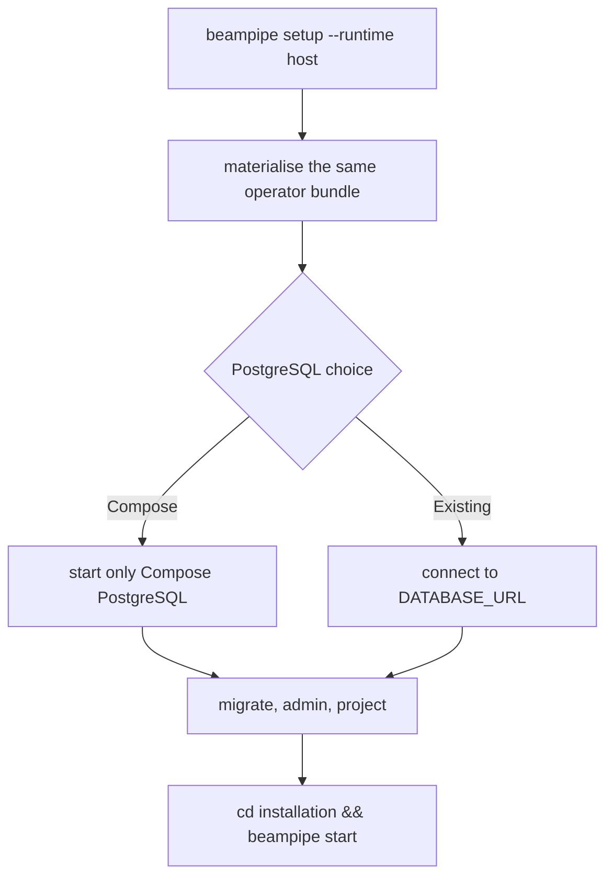
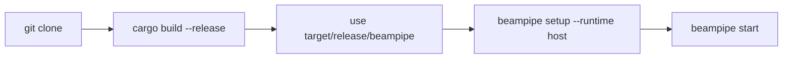
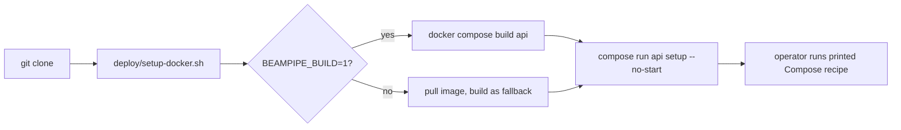
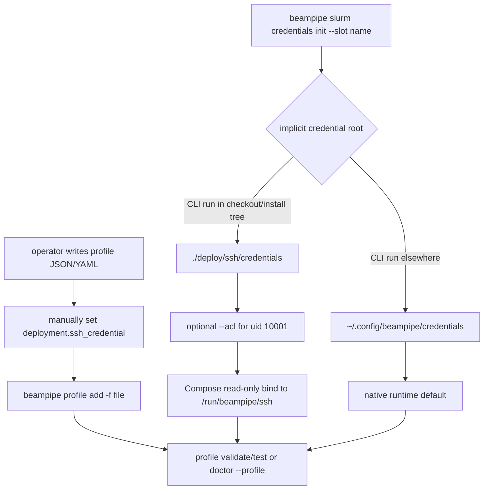
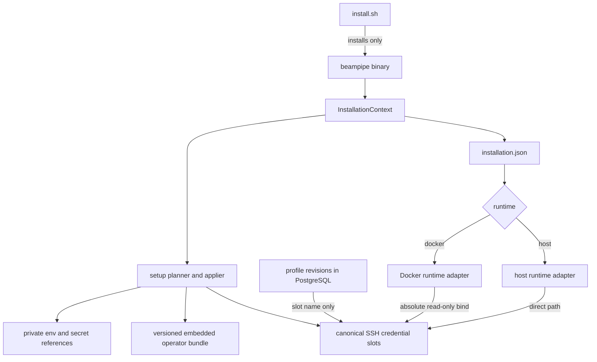
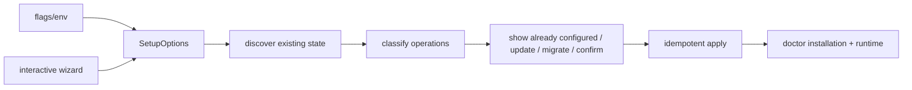

# Installation and setup architecture audit

Status: initial review, before implementation.

This audit treats the Rust source as authoritative. It covers release and source
installations, Docker and host runtimes, deployment profiles, SSH credential
slots, lifecycle commands, diagnostics, release packaging, and operator
documentation.

## Executive finding

Beampipe already has the right low-level building blocks:

- a small release bootstrap that verifies SHA-256 checksums;
- one downloadable `beampipe` binary;
- an embedded, pull-only operator Compose bundle;
- a host runtime and independently scalable API, scheduler, and worker roles;
- typed, revisioned deployment profiles that store an SSH slot name rather than
  key material;
- strict production SSH host verification and private-key validation;
- non-root containers; and
- non-interactive setup flags.

The missing layer is a durable installation identity. Today the current working
directory selects `.env`, `beampipe.yaml`, the operator directory in some cases,
and the CLI credential root in some cases. The Docker bind source and native
runtime then use different defaults. As a result, the same command can refer to
different Beampipe installations or SSH slots depending on where it is run.

The target should preserve the existing primitives and put a single
`InstallationContext` in front of them:

```text
install.sh installs the release binary.
beampipe installs, configures, starts, inspects, and upgrades the installation.
```

## Audit method

The review covered:

- `deploy/install.sh` and `deploy/install-target-test.sh`;
- `.github/workflows/rust.yml` and `.github/workflows/release.yml`;
- CLI command definitions and dispatch in `crates/beampipe-cli/src/main.rs`;
- setup, materialisation, initialization, doctor, operator, and Slurm credential
  modules;
- typed profile validation in `crates/beampipe-profiles`;
- runtime SSH resolution and security policy in `beampipe-orchestration`;
- the release and source Compose files, production overlay, Dockerfile, and env
  templates; and
- README, installation, deployment, profile, SSH, operations, and release docs.

The current CLI unit suite passed: 33 tests. The installer target-mapping test
also passed. Docker is not installed in the audit environment, so a live
`docker compose config` or container readability probe could not be run. Current
CI does not perform either check.

The path ambiguity was reproduced directly:

```text
cwd = repository root  -> deploy/ssh/credentials
cwd = /tmp             -> ~/.config/beampipe/credentials
```

No files were created by that check.

## Current-state architecture

### Shared release flow



`install.sh` is appropriately small. It detects four release targets, downloads
the archive and checksum file, installs one binary, offers a PATH update, and
delegates setup to Rust. Piped non-interactive input defaults to Docker unless a
runtime flag was supplied.

### A. Release to Docker



What the user still needs to know:

- later lifecycle operations are direct `docker compose` commands run from the
  installation directory;
- deployment profiles and SSH credentials are separate follow-up procedures;
- the credential bind source is the relative path
  `./deploy/ssh/credentials`; and
- setup cannot use an external PostgreSQL service with Docker because an
  `existing` selection is changed back to the Compose service.

The host-side migration/admin step works for a local Docker engine because
PostgreSQL is published on port 5432. It does not work correctly for a remote
Docker context: setup checks local ports and connects to local `localhost`, while
the service runs on the remote engine.

### B. Release to host



Host mode is a real runtime, but it remains working-directory dependent because
settings load `.env` and `beampipe.yaml` relative to the process directory. In
non-interactive mode setup prints a `cd ... && beampipe start` recipe. Interactive
setup may start the foreground process itself.

If the materialised Compose file exists, non-interactive host setup defaults to
Compose PostgreSQL. This is useful, but it is not clearly represented as a
separate database choice in the completed installation.

### C. Source to host



Because the checkout contains `docker-compose.yml`, setup without `--directory`
selects the checkout as the operator root. This developer shortcut is convenient
but is also the root cause of accidental installation selection by current
directory.

### D. Source to Docker



This remains a sensible developer path. The helper intentionally uses the
checkout as a bind-mounted build/configuration context and should not be reused
as the ordinary release installer.

### E. Profile to SSH credentials to runtime



The storage model is correct: the profile stores only a validated slot name and
the runtime resolves key, passphrase, and `known_hosts` files. The user journey
is not integrated. Setup does not create a profile or slot, profile creation is
file-only, key import is absent, association is manual, and container
readability is not verified.

## Concrete problems

### Critical path and state issues

| ID | Classification | Problem and evidence | Effect |
|---|---|---|---|
| I-01 | Path/state ambiguity | `materialize::default_operator_directory` selects any current directory containing `docker-compose.yml`; `setup::resolve_operator_root` uses it. | An unrelated Compose directory can silently become the Beampipe installation. |
| I-02 | Path/state ambiguity | `Settings::load` calls `dotenvy::dotenv()` and defaults `beampipe.yaml` relative to cwd. Most CLI operations do not resolve an installation first. | `start`, `doctor`, `status`, profiles, and admin commands can use different configuration depending on cwd. |
| I-03 | Bug | CLI `default_credentials_root` prefers cwd `deploy/ssh/credentials`; runtime `ssh_credentials_dir` does not. It prefers the env override, `/run/beampipe/ssh`, then `~/.config/beampipe/credentials`. | In host mode, the credential command can create a slot that the runtime cannot see even when both run from the installation directory. |
| I-04 | Bug / idempotency | Setup reads `BEAMPIPE_JWT_SECRET` from the process environment before loading an existing installation `.env`, then rewrites `.env`. It also always writes `BEAMPIPE_USE_REAL_BACKENDS=false`. | Rerunning setup from another directory can rotate JWT sessions and disable configured backends. |
| I-05 | Missing functionality | There is no persisted non-secret installation record. | Runtime, home, bundle version, Compose project, env path, and credential root must be inferred repeatedly. |
| I-06 | Maintainability issue | `run_setup` changes the process cwd and mixes prompting, materialisation, env editing, Docker control, DB provisioning, admin creation, project upload, doctor, and optional Dash cloning in one 1,600-line module. | Tests cannot exercise a setup plan independently of side effects, and path assumptions spread across functions. |

### Runtime and lifecycle issues

| ID | Classification | Problem and evidence | Effect |
|---|---|---|---|
| R-01 | UX fragmentation | `beampipe start` always starts the host API/embedded worker. There are no `stop`, `restart`, or `logs` commands for an installed Docker runtime. | Docker users must change directory and use Compose directly after setup. |
| R-02 | Missing functionality | `beampipe status` is a database queue summary, not installation/service status. | It cannot answer whether Docker, API, scheduler, worker, or configured image is healthy. |
| R-03 | Bug | Docker setup checks local ports and the host binary connects to `localhost:5432` after starting Compose. | Setup is incorrect for remote Docker contexts, despite reporting the selected context. |
| R-04 | UX fragmentation | Docker setup overrides an explicit existing-Postgres choice with Compose PostgreSQL. | A release user cannot choose Docker services with an external database through setup. |
| R-05 | Security/permissions issue | The pull-only operator bundle publishes PostgreSQL, API, and metrics on all interfaces by default and uses the `postgres` password for its bundled database. | The beginner path is more exposed than a local default should be. Production checks catch the password only after a production configuration is selected. |
| R-06 | Missing functionality | Managed operator files are skipped when they already exist; no bundle manifest records ownership or source version. | There is no safe update path for release Compose changes. |
| R-07 | Documentation drift | Documentation describes lifecycle operations mainly as `docker compose ...`, including required cwd knowledge and internal services. | The binary is not yet the stable management facade advertised by the installer. |
| R-08 | UX fragmentation | Optional Dash preparation clones a Git checkout and writes a sibling override. | An ordinary release user selecting Dash needs Git/source layout knowledge instead of a released dashboard image/bundle entry. |

### Profile and SSH workflow issues

| ID | Classification | Problem and evidence | Effect |
|---|---|---|---|
| S-01 | UX fragmentation | `profile add` accepts only a complete file; credentials are managed under `slurm credentials`; the slot is associated by manually editing the profile first. | The normal Slurm setup is five disconnected operations. |
| S-02 | Missing functionality | Credential commands can generate, list, show, and check, but cannot import an existing key, remove a slot, rotate a slot, or verify its Docker mount. | Users must copy files and reason about paths/permissions manually. |
| S-03 | Bug | `--acl` grants uid 10001 read permission only on key/passphrase files. The slot directory is set to mode 0700 and receives no traverse ACL. Missing `setfacl` is reported but treated as success. | A Linux container can still be unable to reach the key, while the command appears successful. |
| S-04 | Security issue | Key generation passes the passphrase to `ssh-keygen -N` as a process argument and retains it in ordinary `String` values. | Another local process may observe the passphrase in the process table; memory is not zeroized. |
| S-05 | Security issue | `ssh-keyscan` output is accepted immediately without showing or pinning a fingerprint. | The setup automates trust-on-first-use without an explicit trust decision. |
| S-06 | Bug | Credential init has no SSH port option; `ssh-keyscan` and `ssh-copy-id` assume port 22. Profiles support a custom `ssh_port`, and runtime host matching is port-aware. | Slots prepared for non-default SSH ports can fail strict host verification or copy to the wrong endpoint. |
| S-07 | Reliability issue | `--force` removes an existing private/public key before invoking `ssh-keygen`; file and env updates use direct writes rather than atomic replacement. | A failed command can leave a previously working slot or configuration damaged. |
| S-08 | UX fragmentation | `print_init_next_steps` tells users to run `setfacl` and manually set `deployment.ssh_credential`. | Repository/container implementation details leak into the beginner path. |
| S-09 | Missing functionality | Profile CLI has add/list/validate/test/render but no guided create, edit, remove, default selection, or integrated SSH configuration. | The API/profile repository is capable of revisions, but CLI setup remains file-centric. |

### Diagnostics, release, and secret issues

| ID | Classification | Problem and evidence | Effect |
|---|---|---|---|
| D-01 | Missing functionality | `doctor` loads cwd-relative settings and attempts the DB connection before installation, Docker, bundle, env, or credential-root checks. | A DB failure suppresses most useful diagnosis of why setup is broken. |
| D-02 | Missing functionality | Doctor does not inspect Compose mounts, image/version, service health, or key readability inside API/scheduler/worker containers. | Host files can look correct while the runtime cannot use them. |
| D-03 | Security issue | `--admin-password` is a public setup/admin CLI option and the documentation install builder can place it in shell history. | Passwords can leak through shell history and process arguments. |
| D-04 | Maintainability issue | `.env` updates are hand-written line replacement with no Compose/dotenv quoting model. | Values containing interpolation or comment characters can be misinterpreted. |
| D-05 | Bug / release drift | Embedded env and Compose defaults pin `0.1.0`; setup fills from those static templates rather than the running binary version. | A newer release binary can materialise or pull an older image unless the release process updates every duplicate manually. |
| D-06 | Test gap | CI tests target mapping but not download naming/checksum failure/install destination/setup forwarding, generated Compose validity, or temporary-HOME non-interactive setup. | The documented clean-install path can drift without failing CI. |

## Proposed architecture

### One installation context

Add a reusable `InstallationContext` resolved before commands that operate an
installation.

Resolution precedence:

1. global `--home PATH`;
2. `BEAMPIPE_HOME`;
3. `$HOME/beampipe`.

`setup --directory` remains as a compatibility alias for `--home` during a
deprecation period. Current directory must not select an installation. Source
developers use `--home "$PWD"` or `BEAMPIPE_HOME="$PWD"` explicitly.

Every path is normalized to an absolute path. The context owns:

```text
$BEAMPIPE_HOME/
|-- installation.json          # non-secret, versioned schema
|-- .env                       # mode 0600, runtime secrets/references
|-- beampipe.yaml              # non-secret application configuration
|-- runtime/
|   `-- docker-compose.yml      # CLI-managed operator bundle
|-- config/                     # project/profile authoring files
|-- credentials/
|   `-- ssh/
|       |-- known_hosts         # optional installation-wide trust file
|       `-- <slot>/
|           |-- private_key
|           |-- private_key.pub
|           |-- passphrase
|           `-- known_hosts
`-- state/                     # non-secret pid/log metadata when needed
```

`installation.json` contains no secrets. It records at least:

```json
{
  "schema_version": 1,
  "beampipe_version": "0.2.0",
  "runtime": "docker",
  "home": "/home/operator/beampipe",
  "environment_file": "/home/operator/beampipe/.env",
  "config_file": "/home/operator/beampipe/beampipe.yaml",
  "credential_root": "/home/operator/beampipe/credentials/ssh",
  "operator_bundle_version": "0.2.0",
  "compose_project": "beampipe"
}
```

The stored home and paths are validation aids, not a second selector. The flag,
environment variable, or default selects the installation; the state file must
agree with that selection.

### Source-of-truth relationships



Responsibilities:

| Component | Owns | Must not own |
|---|---|---|
| `install.sh` | platform mapping, download, checksum, binary install, setup exec | configuration policy, Docker orchestration, SSH files |
| CLI installation layer | home resolution, state, planning, migration, lifecycle dispatch | workflow ledger semantics |
| setup engine | idempotent desired-state application | duplicated interactive and unattended implementations |
| operator bundle | version-matched release service definitions | user secrets or mutable profile data |
| Docker adapter | pull/up/down/restart/logs/inspect using explicit project directory | implicit cwd selection |
| host adapter | foreground compact runtime and service-manager guidance | pretending it can stop an unrelated foreground process |
| profile service | typed non-secret deployment revisions | private key paths or bytes |
| credential service | slot files, permissions, trust, import/generation, runtime visibility | profile infrastructure policy |

### Setup plan and apply

Refactor setup around one `SetupOptions` and a serializable `SetupPlan`:



The engine must load existing state and `.env` before generating values. It
preserves JWT/database credentials, profile revisions, project revisions, SSH
slots, and volumes by default. `--force` permits replacement only for explicitly
named managed assets; destructive reset is a separate, confirmed operation.

Interactive prompts only populate `SetupOptions`. `--yes` executes the same
plan. Add `--plan` or `--dry-run` output so automation can review changes.

### Runtime management

Keep `serve` and `worker` as low-level process-role commands. Make installed
lifecycle commands resolve the selected installation:

| Command | Docker installation | Host installation |
|---|---|---|
| `beampipe start` | pull if required, Compose up, wait, health summary | run compact process in foreground, preserving current behavior |
| `beampipe stop` | Compose stop for Beampipe services | stop a CLI-managed/service-manager instance; otherwise explain foreground shutdown |
| `beampipe restart` | recreate only changed services | service-manager restart or actionable unsupported message |
| `beampipe status` | installation plus Compose/API/scheduler/worker status | installation plus DB/API/worker status |
| `beampipe logs` | Compose logs with service/follow/tail options | managed log file or service-manager logs |
| `beampipe doctor` | static, Docker, DB, app, profile, credential checks | static, DB, app, profile, credential checks |

Docker commands always include an explicit project directory, env file, Compose
file, and project name from `InstallationContext`. They never depend on caller
cwd. Migrations, admin creation, and project upload for a Docker runtime execute
inside a one-shot container, which also works with a remote Docker context.

The release bundle binds local API, PostgreSQL, and metrics ports to loopback by
default. Production ingress and external databases are explicit setup choices.

### Profile and credential integration

Retain all existing advanced commands and add a guided profile path:

```text
beampipe profile create
beampipe profile configure-ssh PROFILE
```

For `slurm_remote`, the wizard offers:

```text
Use existing slot
Import existing host key
Generate dedicated key
Configure later
```

The profile continues to store only `ssh_credential: <slot>`. The wizard calls
the same credential service used by standalone commands.

Extend the existing hierarchy rather than replacing it:

```text
beampipe slurm credentials init
beampipe slurm credentials import
beampipe slurm credentials list
beampipe slurm credentials show
beampipe slurm credentials check
beampipe slurm credentials remove
beampipe slurm credentials sync
```

`sync` does not copy keys into containers. It confirms the canonical absolute
bind source, expected `/run/beampipe/ssh` target, directory traversal and file
readability, Compose service mounts, and live container visibility. A changed
bind source recreates only API/scheduler/worker. File changes inside an existing
bind require no restart unless the runtime caches loaded credentials.

### Credential migration

New installations use `$BEAMPIPE_HOME/credentials/ssh`. Upgrade discovery checks:

1. the state-file credential root;
2. explicit `BEAMPIPE_SSH_CREDENTIALS_DIR` or host bind configuration;
3. legacy `$BEAMPIPE_HOME/deploy/ssh/credentials`; and
4. legacy `$HOME/.config/beampipe/credentials`.

Rules:

- one non-empty legacy root: offer an atomic move or record it in state;
- multiple roots where only one is non-empty: select the non-empty root and
  report it;
- multiple non-empty roots: fail with an ambiguity report and require
  `--credentials-dir` or a migration command;
- no roots: create the canonical managed root;
- never merge or overwrite private keys implicitly.

Compose receives the selected absolute host path. All processes receive the
same resolved runtime path.

## Proposed user journeys

### Fresh Docker user

```bash
curl -fsSL https://github.com/jbwod/beampipe-core-v2/releases/latest/download/install.sh | sh
```

The interactive CLI selects Docker by default, creates the installation,
materialises the matching pull-only bundle, configures PostgreSQL and an admin,
starts the services, and prints health. Later:

```bash
beampipe status
beampipe logs --service worker --tail 100
beampipe doctor
beampipe restart
```

Unattended equivalent:

```bash
curl -fsSL https://github.com/jbwod/beampipe-core-v2/releases/latest/download/install.sh \
  | sh -s -- --yes --runtime docker --no-start
beampipe start
beampipe doctor
```

### Fresh host user

```bash
curl -fsSL https://github.com/jbwod/beampipe-core-v2/releases/latest/download/install.sh \
  | sh -s -- --runtime host
beampipe start
```

Setup explicitly asks whether PostgreSQL is existing or the only Docker-managed
dependency. The summary states whether `start` is a foreground process or a
configured system service.

### Remote Slurm user

```bash
beampipe profile create
# choose slurm_remote, configure infrastructure, then import/generate/use a slot
beampipe profile validate setonix
beampipe slurm credentials check --slot setonix --profile setonix
beampipe doctor --profile setonix --remote
```

Non-interactive import uses file paths, never private-key contents or
passphrases on argv:

```bash
beampipe slurm credentials import \
  --slot setonix \
  --private-key-file "$HOME/.ssh/id_ed25519" \
  --known-hosts-file "$HOME/.ssh/known_hosts"
beampipe profile configure-ssh setonix --slot setonix --yes
beampipe slurm credentials sync --slot setonix
```

### Existing user upgrading

```bash
beampipe setup --plan
beampipe setup --migrate
beampipe doctor
beampipe start
```

The plan reports the detected old operator root, env file, bundle version,
Compose project, profiles, volumes, and all candidate credential roots. It does
not change secrets or start services until applied. Ambiguous credential trees
require an explicit choice.

### Developer building from source

Host:

```bash
git clone https://github.com/jbwod/beampipe-core-v2.git
cd beampipe-core-v2
cargo build --locked --release -p beampipe-cli --bin beampipe
BEAMPIPE_HOME="$PWD/.dev-install" target/release/beampipe setup \
  --yes --runtime host --no-start
BEAMPIPE_HOME="$PWD/.dev-install" target/release/beampipe start
```

Docker:

```bash
git clone https://github.com/jbwod/beampipe-core-v2.git
cd beampipe-core-v2
BEAMPIPE_BUILD=1 ./deploy/setup-docker.sh --yes --skip-admin --skip-upload
BEAMPIPE_HOME="$PWD" target/release/beampipe start
```

The developer helper remains available; the release bundle never gains a build
context.

## Security analysis

### Private keys

- Slots remain outside profiles, Git, images, PostgreSQL, and command arguments.
- Import copies by default into a Beampipe-managed slot. It never changes or
  overwrites the source key. A host-only reference mode may be offered, but must
  be rejected for Docker unless the referenced parent is the configured bind.
- Writes use an `O_EXCL`, mode-0600 temporary file in the destination directory,
  validate/decode the key, fsync, then atomically rename.
- Symlinks and non-regular files are rejected for managed private keys.
- In-process key generation is preferred so passphrases never appear in
  `ssh-keygen` argv. Secret buffers use zeroizing wrappers.

### Host to Docker access

- Compose bind-mounts the canonical absolute credential root read-only at
  `/run/beampipe/ssh` for every role that may resolve credentials.
- The image remains uid/gid 10001 and `no-new-privileges` is retained.
- On native Linux, setup grants only required traverse/read ACL entries to the
  effective container uid mapping. ACL application must include parent and slot
  directories, and missing ACL tooling is a failure with remediation, not
  success.
- Docker Desktop and user-namespace/rootless engines are detected. A disposable
  container performs the authoritative `test -r` check; setup does not assume
  host mode bits imply container readability.
- Private keys remain 0600 or 0400. No fallback makes them world-readable.

### Passphrases

- Interactive entry uses a no-echo prompt.
- Unattended entry uses a file/secret reference.
- Passphrases are never printed, serialized into installation state, or placed
  in profile YAML, shell history, or process arguments.
- Passphrase files remain 0600/0400 and are mounted read-only.

### Host verification

- Existing host-aware, port-aware runtime verification remains authoritative.
- Importing a known-hosts file validates that the profile host and port exist.
- `ssh-keyscan` is an acquisition helper, not automatic trust. Interactive setup
  displays SHA-256 fingerprints and requires confirmation. Non-interactive use
  requires a supplied known-hosts file, expected fingerprint, or explicit
  break-glass acceptance.
- Hashed entries continue to fail clearly until supported by the runtime parser.

### Other secrets and logs

- Deprecate password-bearing CLI flags in favor of prompt, `--password-file`, or
  external secret references. Keep old flags temporarily with a visible warning.
- Redact database credentials, signed URLs, key paths in production output, and
  external error strings using the existing security redaction layer.
- Do not put secrets in `installation.json`, Compose YAML, image layers, profile
  documents, or setup-plan JSON.
- Prefer mounted secret files for production. `.env` remains mode 0600 for local
  installations and non-secret references, with an explicit warning that Docker
  environment values are inspectable by Docker administrators.

## File-level implementation plan

### Retain

| File/module | Reason |
|---|---|
| `deploy/install.sh` | Correct bootstrap boundary; extend tests, keep logic small. |
| `materialize.rs` embedded assets | Release users should not need a checkout. |
| `deploy/operator/docker-compose.yml` | Pull-only operator model; make paths/version generated and local bindings safe. |
| root `docker-compose.yml` and `deploy/setup-docker.sh` | Preserve developer source-build flow. |
| `beampipe-profiles` typed schema | Correct non-secret profile/slot contract. |
| orchestration SSH resolver/security checks | Strong fail-closed runtime base. |
| existing setup/profile/credential command names | Backward compatibility and discoverability. |

### Refactor

| Current file | Target responsibility |
|---|---|
| `main.rs` | CLI definitions and dispatch only; add global installation selector and lifecycle commands. |
| `setup.rs` | Thin setup facade over options, discovery, plan, wizard, apply, and summary modules. |
| `materialize.rs` | Versioned bundle manifest, atomic managed-file updates, no cwd selection. |
| `slurm_credentials.rs` | Reusable credential service with generate/import/remove/check/sync and platform permissions. |
| `doctor.rs` | Phased checks that work without DB and include installation/runtime/mount diagnosis. |
| `operator.rs` profile handling | Guided profile CRUD plus optional credential association. |
| `beampipe-config` loading | Explicit env/config paths from `InstallationContext`; legacy cwd loading only for uninstalled direct-process use. |

### Add

```text
crates/beampipe-cli/src/installation.rs
crates/beampipe-cli/src/setup/options.rs
crates/beampipe-cli/src/setup/wizard.rs
crates/beampipe-cli/src/setup/discovery.rs
crates/beampipe-cli/src/setup/plan.rs
crates/beampipe-cli/src/setup/apply.rs
crates/beampipe-cli/src/runtime/mod.rs
crates/beampipe-cli/src/runtime/docker.rs
crates/beampipe-cli/src/runtime/host.rs
crates/beampipe-cli/src/credentials/mod.rs
crates/beampipe-cli/src/credentials/permissions.rs
crates/beampipe-cli/tests/setup_noninteractive.rs
crates/beampipe-cli/tests/installation_paths.rs
deploy/install-test.sh
```

Exact module boundaries may be collapsed where a file would contain only trivial
delegation.

### Deprecate

- cwd-based installation selection;
- relative `BEAMPIPE_SSH_CREDENTIALS_HOST` in generated release installs;
- setup `--directory` in favor of global `--home` while retaining the alias;
- password values on CLI arguments;
- manual `--acl` as a required happy-path step; and
- cloning Dash source during an ordinary release setup once a published Dash
  image is available.

### Remove only after migration

- creation of new slots under `$BEAMPIPE_HOME/deploy/ssh/credentials`;
- implicit fallback from a selected installation to a second non-empty
  credential root; and
- setup recipes that tell ordinary Docker users to invoke Compose directly.

No legacy credential tree or user-owned Compose/env file is deleted
automatically.

## Implementation slices and commit structure

1. **Installation identity**
   Add context/state resolution, global selector, migration discovery, and
   cwd-independence tests.

2. **Idempotent setup engine**
   Split plan/apply from prompts, preserve existing secrets, use atomic env/state
   writes, and exercise temporary-HOME non-interactive setup.

3. **Runtime facade**
   Add Docker adapter and `start/stop/restart/status/logs`; run Docker-side seed
   operations and support external PostgreSQL.

4. **Credential service**
   Canonical root, secure generate/import/remove, port-aware trust, atomic writes,
   zeroization, and platform-aware permissions.

5. **Profile plus SSH wizard**
   Guided profile creation/editing and optional slot setup while retaining the
   separate storage models.

6. **Doctor and migration**
   Static-first checks, Compose/image/mount/readability checks, safe old-layout
   migration, and actionable repair commands.

7. **Release and documentation**
   Version-matched bundles/images, expanded installer harness, Compose CI,
   Docker/native/source docs, update/reset guidance, and command smoke tests.

Each slice should be a local commit with tests passing. Do not combine credential
migration with key deletion or rotate production secrets as part of a structural
refactor.

## Acceptance criteria

### Installation identity

- Running any management or credential command from `~`, `/tmp`, or the
  installation directory resolves the same selected installation and paths.
- `--home` and `BEAMPIPE_HOME` are deterministic and reported by `status` and
  `doctor`.
- Multiple non-empty legacy credential roots fail with a precise ambiguity error.

### Fresh Docker path

- A clean supported Linux/macOS host can run the release installer without a Git
  checkout or source build.
- Setup materialises a pull-only bundle matching the binary version, uses
  absolute bind sources, starts services, seeds the DB, and verifies API,
  scheduler, and worker health.
- The user does not manually run Compose, edit Compose, copy keys into a
  container, change cwd, or discover an internal helper script.
- The same path works with a selected remote Docker context or fails before
  mutation with a clear unsupported-capability message.

### Fresh host path

- Setup explicitly records existing versus Compose PostgreSQL.
- `beampipe start` works from any cwd using the selected installation.
- Doctor explains missing host dependencies and process/service state.

### Idempotency and upgrades

- A second setup run preserves JWT secret, database credentials, admin, project
  and profile revisions, SSH slots, and data volumes.
- Managed bundle updates are versioned and atomic. User-owned files are never
  overwritten without a plan and confirmation.
- Upgrade tests cover the old operator and both legacy credential layouts.

### Profiles and SSH

- A user can create a Slurm profile and generate/import/select a credential slot
  in one guided flow.
- Private keys never enter profiles, PostgreSQL, Git, images, argv, or logs.
- Key and passphrase remain 0600/0400; known-host trust is host/port-aware and
  explicitly accepted.
- Docker visibility is verified from every service role that can use SSH.
- File changes under an unchanged read-only bind do not force a restart.

### Diagnostics and tests

- `doctor` reports useful installation and Docker failures when PostgreSQL is
  unavailable.
- CI covers cwd-independent paths, materialisation idempotency, temporary-HOME
  unattended setup, existing-install preservation, migration ambiguity, slot
  generation/import, permissions, known_hosts, profile association, installer
  checksum behavior, and generated `docker compose config`.
- README commands are smoke-tested against the release CLI.

The completion bar is reached when a technically competent new user can install,
configure, start, inspect, and repair the standard Docker deployment without
repository-specific knowledge.
