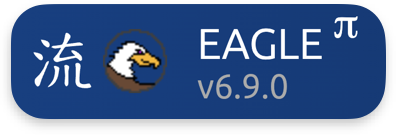

# Deployment profiles

A **deployment profile** stores  **translation** settings and a **deployment** backend. Profiles live in PostgreSQL and are managed via `/api/v1/deployment-profiles`.

Reference by name on `POST /api/v1/executions` (`deployment_profile_name`), or mark one `is_default` per project module.

## How it fits together

<a href="https://daliuge.icrar.org/" class="bp-brand-link"></a> runs your science pipeline. beampipe orchestrates it:

| Stage | beampipe |  |
|-------|----------|---------|
| Manifest | project module `manifest()` | graph drops consume JSON |
| Translate | calls **Translator Manager** (`tm_url`) | logical graph ⮕ PGT |
| Submit | **rest_remote** or **slurm_remote** | runs on compute nodes |

Graphs come from the project module (`GRAPH_GITHUB_URL` or `GRAPH_PATH`). Import companion palettes into <a href="https://eagle.icrar.org/" class="bp-brand-link"></a> when editing graphs visually.


## Profile shape

Every profile has two blocks:

**Translation** (partition the graph via TM):

| Field | Purpose |
|-------|---------|
| `algo` | `metis` or `mysarkar` |
| `num_par`, `num_islands` | Partition / island count |
| `tm_url` | Translator Manager base URL (**required**) |

**Deployment** (one of two backends in the tabs below).

**Scoping:**

| Field | Purpose |
|-------|---------|
| `name` | Unique ID referenced at execution create |
| `project_module` | `null` = global profile |
| `is_default` | Used when execution omits profile name |
| `description` | Operator notes |

## API

```bash
# Create
curl -s -X POST "$BASE/api/v1/deployment-profiles" \
  -H "$AUTH" -H 'Content-Type: application/json' -d @profile.json | jq .

# List / update (filter by your project_module)
curl -s "$BASE/api/v1/deployment-profiles?project_module=wallaby_hires" -H "$AUTH" | jq .
curl -s -X PATCH "$BASE/api/v1/deployment-profiles/{id}" -H "$AUTH" \
  -H 'Content-Type: application/json' -d '{"description":"updated"}' | jq .
```

---

## Choose a backend

=== "rest_remote"

    **DIM REST deploy.** TM partitions the graph, then beampipe submits to a running Data Island Manager over HTTP.

    **Best for:** local dev, desk DIM stacks, staging integration tests.

    **Execute flow:** translate ⮕ REST deploy to DIM ⮕ poll session/graph status URLs on the execution record.

    ### Example JSON

    ```json
    {
      "name": "desk-rest-remote",
      "description": "REST remote against local DIM",
      "project_module": "wallaby_hires",
      "is_default": true,
      "translation": {
        "algo": "metis",
        "num_par": 1,
        "num_islands": 0,
        "tm_url": "http://dlg-tm.desk"
      },
      "deployment": {
        "kind": "rest_remote",
        "dim_host_for_tm": "dlg-dim",
        "dim_port_for_tm": 8001,
        "deploy_host": "dlg-dim.desk",
        "deploy_port": 80,
        "verify_ssl": false
      }
    }
    ```

    ### Deployment fields

    | Field | Required | Description |
    |-------|----------|-------------|
    | `dim_host_for_tm` | yes | DIM hostname as seen by translator |
    | `dim_port_for_tm` | yes | Port for above (default 8001 on create) |
    | `deploy_host` | yes | DIM host for deploy + status polling |
    | `deploy_port` | yes | DIM REST port |
    | `verify_ssl` | no | TLS verification (default `false`) |

    ### Prerequisites

    Worker must reach `tm_url` and `deploy_host:deploy_port` on your network.

=== "slurm_remote"

    **Slurm SSH submit.** Same translation step, then SSH to a login node, upload a generated  INI, and run `python3 -m dlg.deploy.create_dlg_job`.

    **Best for:** production runs on Slurm-managed HPC clusters (`facility` values such as `hyades`, `galaxy`, and others in `SlurmFacility` in the schema).

    ### Example JSON (Slurm HPC)

    ```json
    {
      "name": "hpc-slurm-remote",
      "description": "Slurm remote via SSH",
      "project_module": "wallaby_hires",
      "is_default": true,
      "translation": {
        "algo": "metis",
        "num_par": 1,
        "num_islands": 1,
        "tm_url": "http://dlg-tm.desk"
      },
      "deployment": {
        "kind": "slurm_remote",
        "login_node": "login.hpc.example.edu",
        "ssh_port": 22,
        "remote_user": "your_username",
        "facility": "hyades",
        "account": "your_account",
        "home_dir": "/scratch/your_account",
        "log_dir": "/scratch/your_account/youruser/dlg/log",
        "dlg_root": "/scratch/your_account/youruser/dlg",
        "modules": "module load python/3.11",
        "venv": "source /path/to/venv/bin/activate",
        "exec_prefix": "srun -l",
        "job_duration_minutes": 50,
        "num_nodes": 1,
        "num_islands": 1,
        "verify_ssl": false
      }
    }
    ```

    ### Generated  INI

    beampipe renders an INI from the profile and uploads it next to the PGT on the cluster. Example (paths match the JSON above):

    ```ini
    [DEPLOYMENT]
    remote = False
    submit = False

    [ENGINE]
    NUM_NODES = 1
    NUM_ISLANDS = 1
    ALL_NICS =
    CHECK_WITH_SESSION =
    MAX_THREADS = 0
    VERBOSE_LEVEL = 1
    ZERORUN =
    SLEEPNCOPY =

    [GRAPH]
    PHYSICAL_GRAPH = /scratch/your_account/youruser/dlg/staging/BeampipeExecution_<uuid>.pgt.graph

    [FACILITY]
    USER = your_username
    ACCOUNT = your_account
    LOGIN_NODE = login.hpc.example.edu
    HOME_DIR = /scratch/your_account
    DLG_ROOT = /scratch/your_account/youruser/dlg
    LOG_DIR = /scratch/your_account/youruser/dlg/log
    MODULES = module load python/3.11
    VENV = source /path/to/venv/bin/activate
    EXEC_PREFIX = srun -l
    ```

    See <a href="https://daliuge.readthedocs.io/en/latest/deployment/slurm_deployment.html#configuration-ini" class="bp-brand-link"></a> Slurm deployment for field semantics.

    ### SSH transport

    | Field | Required | Description |
    |-------|----------|-------------|
    | `login_node` | yes | HPC login hostname |
    | `ssh_port` | no | Default `22` |
    | `remote_user` | no | Remote user. Falls back to `USER` |

    Keys live at `./deploy/ssh/id_slurm` (mounted in production workers). Sync `known_hosts` with `make slurm-known-hosts-sync`. Add `id_slurm.pub` to the login node `authorized_keys`.

    ### Cluster /  paths

    | Field | Required | Description |
    |-------|----------|-------------|
    | `account` | yes | Slurm project account |
    | `home_dir`, `log_dir` | yes | Scratch paths on cluster |
    | `dlg_root` | yes |  install root |
    | `facility` | no |  facility id (maps to `create_dlg_job -f`) |
    | `modules`, `venv` | no | Shell snippets sourced before submit |
    | `job_duration_minutes` | no | Wall time (`-t`) |
    | `num_nodes`, `num_islands` | no | Resource flags |

    !!! note
        Translation still uses a **Translator Manager** reachable from the beampipe worker, even when compute runs on a remote cluster.

## Related

- [Project modules](../project-modules/lifecycle.md) (manifest origin)
- [API reference](../api/index.md) (CRUD endpoints)
- [Bruno collection](../tools/bruno.md) (create profile + execute workflow)
