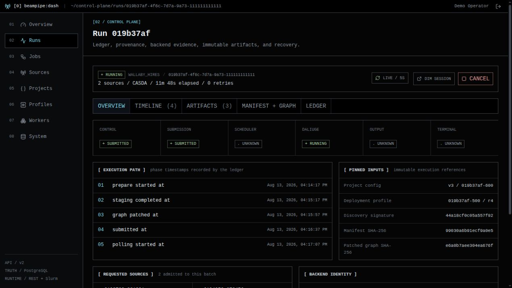

# Dashboard tour

[Beampipe Dash](https://github.com/jbwod/beampipe-dash) is the optional web
operator console for Beampipe Core. It calls the authenticated `/api/v2`
interface through a server-side BFF; it does not own a database, execute jobs,
or infer workflow state independently of Core.

The screenshots on this page use Dash's checked-in synthetic Beampipe fixture.
They are safe documentation examples rather than evidence from a production
deployment.

## Control-plane overview

The overview brings several Core signals together for triage:

- authenticated readiness for PostgreSQL, queues, CASDA, and VizieR;
- registered sources and pending workflow admission;
- running and failed executions;
- active or stale workers and durable queue depth;
- recent API traffic and operator alerts.

Dash reports these values; Core's database, readiness probes, worker registry,
and execution ledger remain authoritative.

## Project studio

The project studio keeps the form-based survey policy and canonical
`beampipe.dev/v2` YAML visible together. A successful save creates an immutable
project-config revision in Core. Executions pin a revision, so editing a later
version cannot silently change an existing run.

Use the Core [project YAML reference](../project-configs/index.md) for schema,
transform, query, graph, and automation semantics.

## Run detail

The run explorer follows Core's durable execution model. It exposes normalized
control, submission, scheduler, DALiuGE, output, and terminal states alongside
phase timestamps and pinned inputs. Timeline, artifact, graph, manifest, and
ledger tabs retain the raw evidence needed for diagnosis.

Use the Core [execution state model](../architecture/state-machine.md) when
interpreting failed, uncertain, cancelled, or externally running work.

## Alerts

Dash **Alerts** (`/alerts`) is the operator UI for Core's in-app notification
channels and rules. Superusers can create a webhook (generic, Slack, or
PagerDuty template), bind it to a trigger such as execution failure, discovery
change, or the 24h digest, and send a test payload. The test result is the
redacted delivery row, not the upstream HTTP body. Other authenticated users
can list channels, rules, and deliveries. Secrets stay in Core; Dash omits
redacted fields on save unless a new value is typed.

Prometheus/Alertmanager remains a separate infra-health path. See
[Observability](../operations/observability.md) for trigger kinds and the
headless `curl` equivalents.

## Connect Dash to Core

For a single Docker engine, run Dash `scripts/install.sh` (or `beampipe setup --dashboard`). It attaches Dash to Core's private Compose network and sets `BEAMPIPE_API_URL=http://api:8080`. Publish Dash—not the Core API—to the operator LAN or reverse proxy. See [Install and configure](installation.md) for the setup flags.

