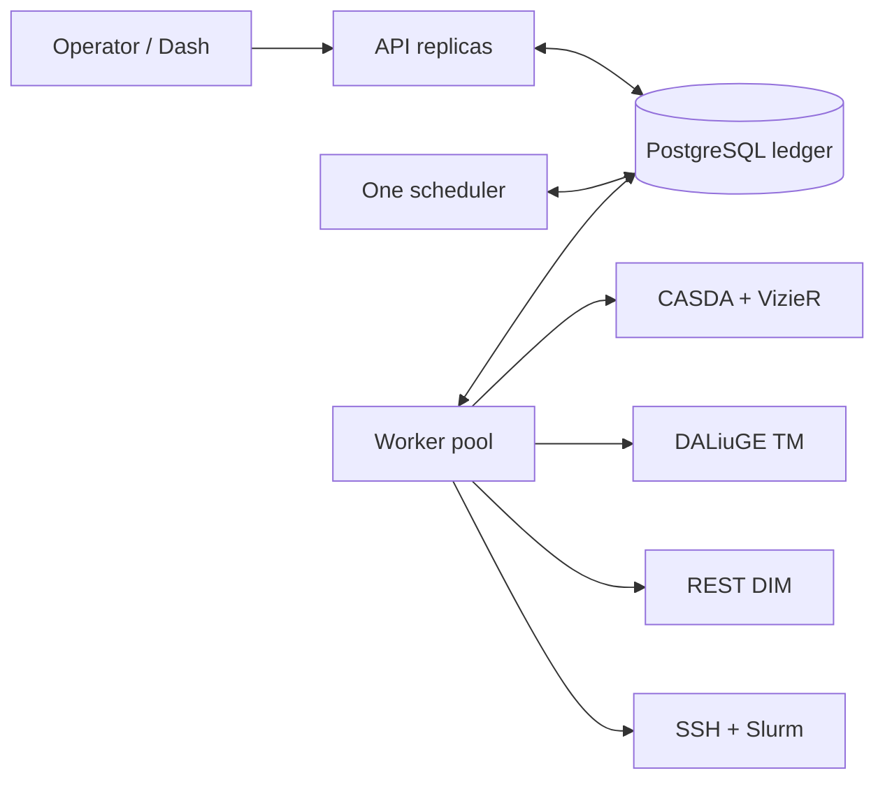

# Deployment topologies

Beampipe ships one binary and one container image. A deployment assigns that
artifact to API, scheduler, and worker roles, connects all roles to one
PostgreSQL ledger, and then gives workers access to the selected execution
backend.

REST/DIM and Slurm describe where DALiuGE work executes. They are independent
of whether Beampipe itself runs natively, in Compose, or on a container
platform.

## Choose a topology

| Topology | Use when | Trade-off |
|---|---|---|
| Compact native | evaluating one project on a workstation | simplest process model; roles cannot scale independently |
| Separated native | operating a managed VM or bare-metal service | ordinary service management; operator owns PostgreSQL and process supervision |
| Docker Compose | running a single-host service or local qualification cluster | reproducible role separation and networks; one Docker engine remains a failure domain |
| Container platform | operating across hosts | independent scaling and secret injection; requires an external PostgreSQL service and scheduler singleton policy |

Every production-shaped layout has exactly one scheduler-enabled process. API
and worker-only processes may scale independently.



## Docker Compose: separated roles

The installer writes a pull-only Compose file to `~/beampipe` and starts the stack. The repository Compose file is for a git checkout (local `build:` fallback and observability profiles).
The installation records its Compose project, env file, bundle, and absolute credential bind. Lifecycle commands use those paths explicitly, so the shell's working directory is irrelevant.

```bash
docker context show
curl -fsSL https://github.com/jbwod/beampipe-core-v2/releases/latest/download/install.sh | sh -s -- --yes --runtime docker
```

Host binary path: `install.sh | sh -s -- --yes --runtime host`, then `beampipe start`. Slurm slots live under `~/beampipe/credentials/ssh/<slot>/` unless another installation home was explicitly selected.

A checkout can still use `./deploy/setup-docker.sh --yes --skip-admin --skip-upload` (`--no-start`) and the printed recipe.

Use the Beampipe lifecycle facade:

```bash
beampipe start
beampipe status
beampipe logs --tail 100
beampipe restart
beampipe stop
```

Verify the public process, authenticated dependency readiness, and role health:

```bash
curl -fsS http://127.0.0.1:18080/api/v2/health
beampipe status
beampipe doctor
```

`/api/v2/health` is liveness. The authenticated `/api/v2/ready` response is
what Dash uses for PostgreSQL, queue, CASDA, and VizieR state.

### Role configuration

| Setting group | API | Scheduler | Worker |
|---|:---:|:---:|:---:|
| Database and JWT | required | required | required |
| TAP endpoint URLs | required for `/ready` and Dash | required for jobs it executes | required for discovery |
| `BEAMPIPE_USE_REAL_BACKENDS` | reported configuration | gates external work | gates external work |
| TM/DIM or SSH reachability | profile inspection | required when it executes jobs | required for execution jobs |
| Scheduler enabled | no | exactly one | no |

Do not infer API readiness from worker environment variables. Each container has
its own environment even when all roles use the same image.

### Workstation bindings

The release operator bundle binds PostgreSQL, API, and metrics to `127.0.0.1` by default. Put an authenticated TLS reverse proxy in front of the API before exposing it beyond the host. Dash can use `http://api:8080` over the private Compose network.

## Core and Dash on one Docker engine

`beampipe setup --dashboard` clones a sibling Dash checkout if needed, then runs Dash `scripts/install.sh`. That script writes `compose.beampipe-local.yml` with `BEAMPIPE_API_URL=http://api:8080` and the recorded Core Compose network. After Core is up, setup starts Dash on that network.

Compose creates project-scoped networks. The installer attaches Dash to the Core network (operator installs are usually `beampipe_default`):

```yaml
services:
  dashboard:
    environment:
      BEAMPIPE_API_URL: http://api:8080
    networks:
      - default
      - beampipe-core

networks:
  beampipe-core:
    external: true
    name: beampipe_default
```

Standalone:

```bash
curl -fsSL https://raw.githubusercontent.com/jbwod/beampipe-dash/main/scripts/install.sh | sh
# or:
./scripts/install.sh --core-home ~/beampipe
```

This keeps bearer-token traffic and the Core API private. Publish only Dash to
the operator interface or reverse proxy.

See the [Dashboard tour](dashboard.md) for screenshots of the overview,
project studio, and durable run explorer, together with the Core state each
screen represents.

## Existing local DALiuGE over REST

Place Beampipe workers, TM, and DIM on a network where their service names
resolve. A local Docker profile commonly looks like:

```json
{
  "name": "dlg-dim",
  "project_module": "wallaby_hires",
  "is_default": true,
  "max_concurrent_executions": 1,
  "translation": {
    "algo": "metis",
    "num_par": 1,
    "num_islands": 1,
    "tm_url": "http://dlg-tm:8084"
  },
  "deployment": {
    "kind": "rest_remote",
    "dim_host_for_tm": "dlg-dim",
    "dim_port_for_tm": 8001,
    "deploy_host": "dlg-dim",
    "deploy_port": 8001,
    "use_https": false,
    "verify_ssl": true
  }
}
```

`dim_host_for_tm` is resolved by TM; `deploy_host` is resolved by the Beampipe
process performing submission and polling. They may differ across network
boundaries.

```bash
beampipe profile add -f profile.json
beampipe profile validate dlg-dim
beampipe doctor --profile dlg-dim
beampipe daliuge inspect --profile dlg-dim
```

Endpoint health is not a runtime contract test. Pin and verify the DALiuGE
image/version, graph SHA-256, and every graph application package on all node
managers before qualification.

## Native services

Build or install one release binary, then run separate units with a shared
configuration source:

```bash
beampipe serve --worker false
BEAMPIPE_WORKER_SCHEDULER_ENABLED=true beampipe serve --worker true
BEAMPIPE_WORKER_SCHEDULER_ENABLED=false beampipe worker
```

Give colocated roles unique bind and metrics addresses. Use service-manager
credentials or mounted files for secrets, and run migrations as an explicit
release step before restarting roles.

## Container platforms

Use one deployment for API replicas, one singleton scheduler deployment, and
one or more worker pools selected by capability labels. Use readiness probes
for traffic routing, liveness probes for process restart, and a migration job
for schema changes. Mount graph paths and credentials at identical container
paths wherever the corresponding jobs may run.

The database is the coordination boundary. Do not use local container storage
for PostgreSQL in a multi-host production deployment.

## Safe upgrade

Release installations do not need a checkout. Install the newer binary and rerun setup:

```bash
beampipe setup
beampipe doctor
beampipe restart
```

Setup upgrades only unmodified managed bundle files and reports operator-edited files. Before a production upgrade:

1. Record `docker context show`, the repository commit, active project hashes,
   and deployment-profile revisions.
2. Back up PostgreSQL with `scripts/pg-backup.sh`.
3. Copy `.env` to an operator-owned protected location and record its SHA-256.
4. Rerun setup and review any preserved bundle customizations.
5. Run migrations, recreate roles, and repeat health and profile checks.

Never remove all Docker volumes or networks as a generic reset. Resolve exact
Compose project resources first, and preserve Portainer or other management
stacks that share the engine.
