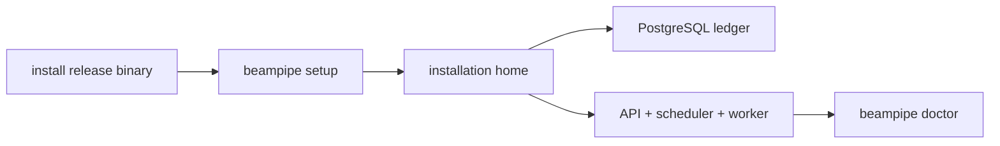

# Quick start

The recommended installation needs Docker with Compose v2 and ports `5432`, `18080`, and `9090`. Override host ports with `--api-port`, `--postgres-port`, and `--metrics-port`.

```bash
curl -fsSL https://github.com/jbwod/beampipe-core-v2/releases/latest/download/install.sh | sh
```

Choose Docker and the managed PostgreSQL service. Setup writes `~/beampipe`, creates private random credentials, seeds the reference project, and starts API, scheduler, and worker services.



Verify without changing directories:

```bash
beampipe status
beampipe doctor
curl -fsS http://127.0.0.1:18080/api/v2/health
```

Common operations:

```bash
beampipe logs --follow
beampipe restart
beampipe stop
beampipe start
beampipe uninstall
```

External execution remains disabled until a typed deployment profile is installed and checked. Interactive `install.sh` / `beampipe setup` prompts those Next actions after the stack is up. With `--yes`, do them afterwards:

```bash
beampipe profile add -f "$HOME/beampipe/config/deployment_profile.dlg-dim.json"
beampipe doctor --profile dlg-dim
# set CASDA credentials for staging (Next actions, or CASDA_USERNAME in ~/beampipe/.env)
# then set BEAMPIPE_USE_REAL_BACKENDS=true in ~/beampipe/.env and run beampipe restart
```

Continue with:

1. [Install and configure](installation.md) for Docker, native host, and source-build paths.
2. [Deployment profiles and SSH](../architecture/deployment-profiles.md) for REST/DIM or Slurm.
3. [First workflow](first-run.md) to register and discover a source.
