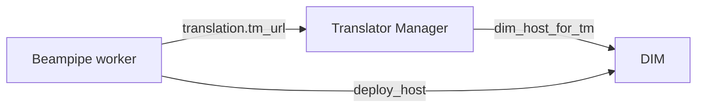
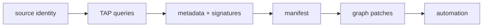

# REST demonstration playbook

Demonstrate multiple WALLABY sources from registration through separate terminal DALiuGE executions using the compiled `beampipe` binary, `curl`, and `jq`. There is no Jupyter or Python orchestration layer.

The complete copy-and-run playbook is [playbooks/rest_remote_no_downloads.md](https://github.com/jbwod/beampipe-core-v2/blob/main/playbooks/rest_remote_no_downloads.md). Run it from the repository root.

## Demonstration boundary

<div class="bp-flow-diagram bp-flow-diagram--wide bp-flow-diagram--animated" role="img" aria-label="No-download REST demonstration from project configuration through source discovery and separate DALiuGE executions">
  <div class="bp-flow-node" data-tone="cyan"><span>CONFIG</span><strong>project + profile</strong><small>binary commands</small></div>
  <span class="bp-flow-link" aria-hidden="true">--&gt;</span>
  <div class="bp-flow-node" data-tone="cyan"><span>DISCOVER</span><strong>multiple sources</strong><small>curl + TAP</small></div>
  <span class="bp-flow-link" aria-hidden="true">--&gt;</span>
  <div class="bp-flow-node" data-tone="amber"><span>PREVIEW</span><strong>manifest + graph</strong><small>operator pause</small></div>
  <span class="bp-flow-link" aria-hidden="true">--&gt;</span>
  <div class="bp-flow-node" data-tone="green"><span>ADMIT</span><strong>one run per source</strong><small>durable jobs</small></div>
  <span class="bp-flow-link" aria-hidden="true">--&gt;</span>
  <div class="bp-flow-node" data-tone="green"><span>REST</span><strong>TM + DIM</strong><small>deploy + poll</small></div>
</div>

The project uses the no-download graph and `archive_name: no_downloads`. Discovery still queries CASDA and VizieR, but execution does not request CASDA staging. This proves control-plane and DALiuGE runtime behavior, not scientific products.

CASDA credentials are not required: discovery uses public TAP access and authenticated staging is skipped.

## Prerequisites

```bash
cargo build --locked --release -p beampipe-cli --bin beampipe
docker compose up -d postgres
```

Docker is optional when `DATABASE_URL` already points at PostgreSQL. The operator terminal also needs `curl`, `jq`, `sed`, and `openssl`.

Run a mock rehearsal first. The playbook's `LIVE_SUBMIT=false` still performs live archive discovery and graph preparation, but uses mock execution clients. Change it to `true` only when the REST profile test passes against the intended Translator Manager and DIM.

## Three-terminal layout

| Terminal | Process | Scheduling |
|---|---|---|
| A | `beampipe serve --worker false` | API only |
| B | `beampipe worker` | Disabled during discovery and graph review |
| C | `curl` and `jq` | Operator intent and evidence |

At the go/no-go point, stop Terminal B and restart it with `BEAMPIPE_WORKER_SCHEDULER_ENABLED=true`. That explicit action permits automatic execution admission.

## Deployment profile, start to finish

The tracked starting point is `playbooks/config/rest_remote.local.json`.



1. Choose an immutable profile name and project scope.
2. Configure Translator Manager URL and partitioning policy.
3. Configure both DIM address perspectives; they may differ across Docker, VPN, and host networks.
4. Keep `verify_ssl: true` for production HTTPS.
5. Begin with a low `max_concurrent_executions`.
6. Install with `beampipe profile add -f PROFILE.json`.
7. Run `profile validate`, `profile render`, then the live `profile test`.
8. Reference the exact profile name in project execution automation.

Profiles contain no credentials. External secrets remain environment or mounted-file references.

## Project YAML, start to finish

The tracked project is `playbooks/config/wallaby_hires_no_downloads_rest.v2.yaml`. All TAP ADQL is dynamically loaded from this file.



1. Define canonical source identity and reusable transforms.
2. Set TAP timeout, retries, and fail policy.
3. Define primary CASDA/VizieR queries and SBID enrichment queries.
4. Map required dataset identity and readiness flags.
5. Exclude only volatile metadata from stable signatures.
6. Define manifest grouping and templates.
7. Pin the logical graph and patch exact node/field names.
8. Configure discovery shaping and one-source-per-run execution admission.
9. Validate with `project validate`, `project explain`, and `project render`.
10. Activate with `project add`, then prove representative discovery and graph previews before enabling scheduling.

## Operator pause

Continue to live scheduling only when:

- project and profile revisions validate;
- the REST profile test passes;
- all selected sources are ready;
- the pinned graph is available;
- each source-specific preview has durable hashes;
- both expected graph fields changed;
- the intended `LIVE_SUBMIT` mode is visible in the shell.

## Common stops

| Stop | Meaning | Action |
|---|---|---|
| Profile already exists | The run tag was reused | Choose a fresh run tag; do not overwrite qualified infrastructure policy |
| `ra_dec_vsys_complete` blocks a source | VizieR returned no row or was saturated | Retry later or use an approved mirror/proxy; keep the flag strict for live runs |
| TAP health is `ok`, but discovery fails | Reachability does not prove query capacity | Inspect `discovery-worker.log` for the bounded external error |
| Profile test cannot reach DIM | One of the two DIM address perspectives is wrong | Correct the profile and use a fresh immutable name |
| Fewer executions than sources | Readiness or admission policy blocked work | Inspect source status before changing limits |

Runtime configuration, API responses, graph previews, and terminal ledger snapshots are retained under the ignored `playbook-runs/<RUN_TAG>/` directory.
