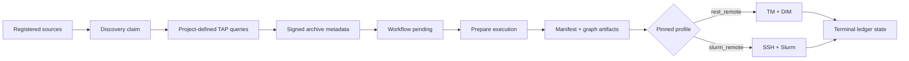

# Dashboard end-to-end operator workflow

This procedure configures project policy, selects an execution backend,
discovers sources, composes a run, and follows durable evidence through Dash.
For the exact local REST qualification values and matching API commands, use
[Local DALiuGE end to end](../getting-started/local-daliuge.md).



## 1. Prove system readiness

Open **System** and confirm PostgreSQL, queue, TAP, DALiuGE/scheduler, and worker
status match the intended environment. Resolve critical diagnostics before
creating external intent.

Equivalent CLI checks are:

```bash
beampipe doctor
beampipe status
beampipe worker list
beampipe doctor --profile PROFILE_NAME
```

## 2. Save project policy

Open **Overview > Project policy**, then choose an existing project or **New**.
The editor covers:

- identity and required adapters;
- TAP timeout/retry policy, queries, and enrichments;
- metadata mappings, transforms, flags, and signature fields;
- graph source, manifest templates, and graph patches;
- discovery, execution, and output-verification policy.

The YAML pane is canonical and synchronizes with the visual editor. Select
**Save version**. Success creates and activates an immutable Core revision;
contract errors remain visible and prevent a valid workflow from being
assumed. Existing executions keep their pinned revision.

## 3. Configure the deployment target

Open **Deployment target**. For REST DIM, remember that TM and workers may need
different DIM addresses. The local qualified profile uses:

```text
name                 dlg-desk
project              wallaby_hires
default              yes
translator URL       http://dlg-tm.desk
deploy host/port     dlg-dim.desk / 80
DIM host/port for TM dlg-dim / 8001
```

When Core runs in Docker, enter names reachable from Core and TM containers,
not addresses that work only in the browser. Save and select **Test**. Both the
translator and manager paths must pass before execution.

For Slurm, configure the login node, account, absolute paths, resources,
manager topology, modules, environment, and runtime inputs. The Test action
checks SSH/Slurm connectivity and renders the effective request. Keys and
passphrases remain external Core credential slots and never reach Dash.

## 4. Register and discover sources

Open **Source registry** and select **Register**:

1. Choose the project.
2. Enter one source identifier per line.
3. Select **Register sources**.
4. Select one or more same-project rows.
5. Select **Discover selected** and confirm.

Discovery is asynchronous. Follow `scheduler_tick` and `discover_batch` in
**Jobs**. Open a source to inspect readiness gates, metadata by SBID, current
and last-executed discovery signatures, linked executions, provenance, enabled
state, and stale-after policy.

A source can be composed manually when Admission is ready. When project
execution automation is enabled, changed discovery also marks it pending for
recurring admission.

## 5. Compose and start

Select same-project sources and choose **Compose run**, or open
**Runs > Compose run**:

1. Confirm project, archive, and deployment-profile revision.
2. Select sources and optional SBIDs.
3. Select **Validate selection**.
4. Review source, SBID, and dataset counts.
5. Resolve every blocker.
6. For a full live run, keep **Start immediately** and **Submit backend** on.
7. Keep **Stage inputs** on for a production staging graph; turn it off only
   for an explicitly no-download qualification graph.
8. Select **Create + start**.

Preparation calls Core's authoritative readiness endpoint. Changing a source,
SBID, archive, or profile invalidates the preview. Creation pins the active
project revision and profile snapshot.

If creation returns an ambiguous network failure, Dash preserves the same
idempotency key and freezes the request. Resume that exact intent; do not edit
it into a different run or assume no ledger row was created.

## 6. Interpret the run explorer

| Tab | Evidence |
|---|---|
| Overview | Control, submission, scheduler, DALiuGE, output, terminal state; inputs and timing |
| Timeline | Provenance events in durable order |
| Observations | Normalized and raw DIM/Slurm observations |
| Artifacts | Manifest and graph kinds, hashes, sizes, and downloads |
| Manifest + graphs | Structured data exploration and EAGLE links |
| Ledger | Pinned configuration, active job identity, and compact run state |
| Run record | Staging, backend merges, scheduler metadata, and timestamps |

For the qualified no-download REST run, these simultaneous values are correct:

- control **terminal**;
- submission **submitted**;
- scheduler **not submitted** because no Slurm job exists;
- DALiuGE **finished**;
- output **not required**, only because the pinned project explicitly opted out;
- terminal **succeeded**;
- four artifacts: manifest, source graph, patched graph, and physical graph.

“Not required” is not output verification. A normal production project with
verification required remains non-terminal until its publisher submits valid
durable inventory evidence.

Terminal runs stop automatic detail polling. Use manual refresh when you need
to re-read evidence after an external operator action.

## 7. Recover cautiously

For REST, expect TM translation, DIM deployment, and `dim_poll`. For Slurm,
expect remote staging, `sbatch`, `awaiting_scheduler`, and batched
reconciliation.

Use **Retry** only after reading terminal evidence and entering an operator
rationale. Core derives the safe recovery phase from durable state. **Cancel**
contacts the pinned backend first and records only a confirmed outcome. Never
retry an uncertain submission while an external DIM session or Slurm job may
exist; follow [Recovery and cancellation](recovery.md).
