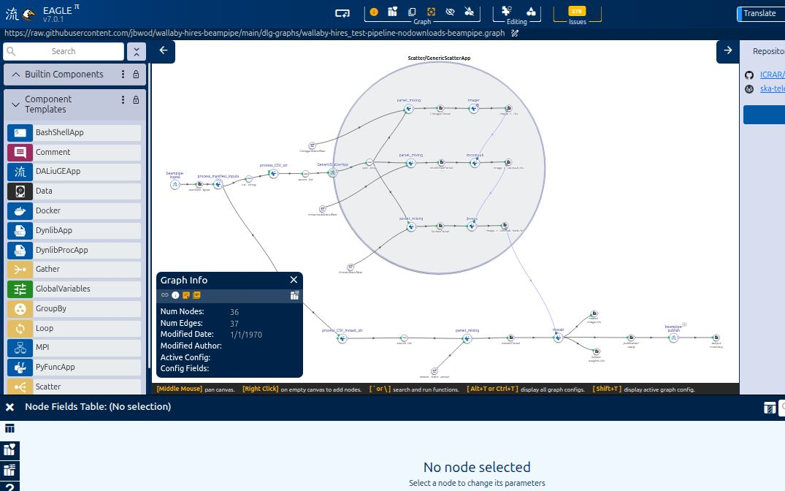
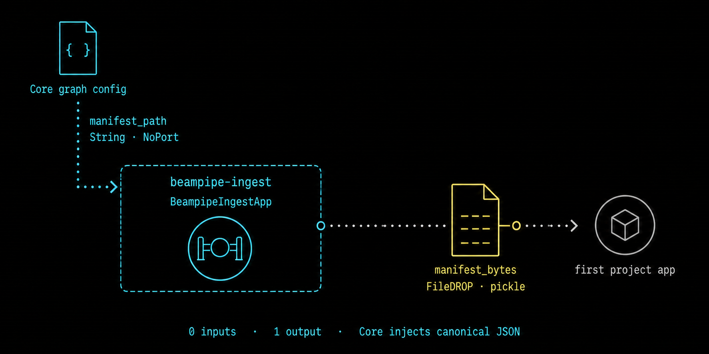
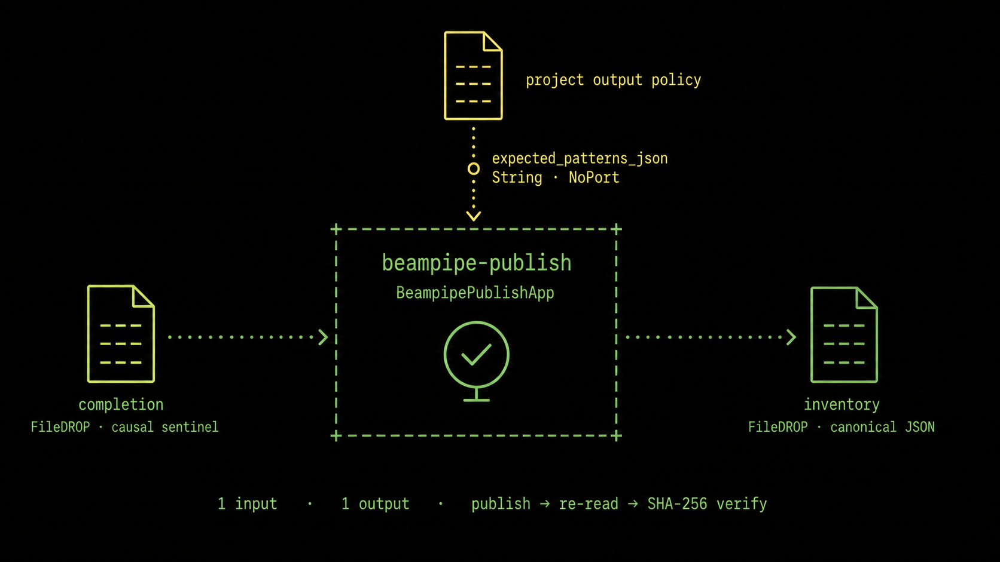

# Preparing DALiuGE graphs in EAGLE

Prepare the scientific workflow in EAGLE, but keep execution identity,
credentials, storage endpoints, and scheduler details outside the logical
graph. A Beampipe-ready graph has two small, stable integration points:

1. `beampipe-ingest` introduces Core's immutable execution manifest at the
   graph boundary.
2. `beampipe-publish` runs after the project pipeline has finished, publishes
   and verifies the required products, and emits the canonical output
   inventory.

Both are native DALiuGE applications supplied by the public
[`beampipe-palette`](https://github.com/jbwod/beampipe-palette) package. They are
not embedded PyFunc source and they do not call back to Core.

## The finished shape

The screenshot below is the real WALLABY no-download graph open in EAGLE
7.0.1. The graph enters through `beampipe-ingest` on the left and finishes
through `beampipe-publish` and `output inventory` on the lower-right branch.
The project-owned processing graph remains between those two boundaries.



*Real EAGLE capture of the
[`wallaby-hires_test-pipeline-nodownloads-beampipe.graph`](https://github.com/jbwod/wallaby-hires-beampipe/blob/fcdca2e2fc5987b10cc5a74c4c007c2f5b8f08f0/dlg-graphs/wallaby-hires_test-pipeline-nodownloads-beampipe.graph)
contract. The screenshot was captured from commit `fcdca2e2` with
`beampipe-palette` 0.5.1.*

The visual order is the execution order:

```text
Core manifest
    |
    v
beampipe-ingest -> manifest_bytes FileDROP -> project applications
                                                     |
                                                     v
                                      completion FileDROP
                                                     |
                                                     v
                                         beampipe-publish
                                                     |
                                                     v
                                          inventory FileDROP

Core later pulls the byte-identical receipt from the remote session over SFTP.
There is no graph edge, URL, or bearer credential back to Core.
```

## Load the Beampipe palette

Install the same release into the Python environment used by every DALiuGE
execution node:

```bash
python -m pip install \
  https://github.com/jbwod/beampipe-palette/releases/download/v0.5.1/beampipe_palette-0.5.1-py3-none-any.whl
python -m beampipe_palette --version
```

In EAGLE, select **Palette → Load** and open `beampipe.palette`. The wheel
installs the palette under:

```text
share/beampipe-palette/daliuge/palettes/beampipe.palette
```

The palette adds exactly two project-neutral application templates:

| Palette component | Native class | Purpose |
|---|---|---|
| `beampipe-ingest` | `BeampipeIngestApp` | validate and emit Core's canonical manifest |
| `beampipe-publish` | `BeampipePublishApp` | publish, verify, and inventory durable products |

Loading the `.palette` file gives EAGLE the node and port metadata. It does not
install the Python implementation on the DALiuGE runtime. The package version
must therefore be present and importable on every execution node:

```text
beampipe_palette.apps.BeampipeIngestApp
beampipe_palette.apps.BeampipePublishApp
```

Pin the graph and runtime package together. Updating either native application
contract requires a new graph digest and another translation/runtime check.

## Wire `beampipe-ingest`

Place `beampipe-ingest` at the entry boundary. It accepts no input DROPs and
has one `manifest_bytes` output. Connect that output to a path-backed FileDROP,
then connect the FileDROP to the first application that consumes the manifest.



*The configuration arrow is not a data DROP. Core supplies `manifest_path` as
a `NoPort` graph setting; the only graph output is `manifest_bytes`.*

| Field or port | EAGLE contract | Owner |
|---|---|---|
| node name | exactly `beampipe-ingest` | graph author |
| `manifest_path` | `String`, `NoPort` | Core injects inline canonical JSON |
| `manifest_bytes` | one `OutputPort` to a FileDROP | native application |
| encoding | `pickle` at a named PyFunc boundary | graph author |

Do not fill `manifest_path` with a workstation path for a Core-managed graph.
Core finds the exact node and field name, injects the execution's immutable
manifest as graph configuration, and records the patched graph checksum.

The native application validates and canonicalizes the manifest before
writing it once. Its output intentionally uses one pickle layer: DALiuGE 6.6
named PyFunc inputs decode `pickle` ports to the original canonical bytes. If
the next application is also native, keep the data contract explicit and test
the chosen encoding through the installed DALiuGE version.

## Build a truthful completion barrier

`beampipe-publish` must not become runnable merely because the graph was
deployed. Feed it one project-owned completion FileDROP that becomes complete
only after every required scientific output is closed and stable.

Good completion signals include:

- a dedicated FileDROP written by the final successful application;
- a gather/barrier output downstream of every required product branch; or
- a final application output created only after all child work has succeeded.

Avoid an unconnected publisher input, an always-present configuration file, or
a marker created before output writers close. Those arrangements can publish
an incomplete result set while the scientific graph is still running.

The completion DROP is causal only. Product discovery starts from the
Core-supplied `BEAMPIPE_OUTPUT_ROOT`; product paths are not carried in the
completion payload.

## Wire `beampipe-publish`

Place `beampipe-publish` after the completion barrier and connect its single
`inventory` output to a terminal path-backed FileDROP. The inventory DROP is
useful to DALiuGE and operators; Core separately retrieves the byte-identical
attempt-scoped handoff after Slurm reports `COMPLETED`.



*Only the completion and inventory connections are DALiuGE data edges.
`expected_patterns_json` is a project-owned `NoPort` setting, and the native
application performs publication, durable read-back, and SHA-256 verification.*

| Field or port | EAGLE contract | Owner |
|---|---|---|
| node name | exactly `beampipe-publish` | graph author |
| `completion` | exactly one FileDROP `InputPort` | project graph |
| `inventory` | exactly one FileDROP `OutputPort` | native application |
| `expected_patterns_json` | `String`, `NoPort`, JSON array | project policy |

For example:

```json
["**/image*.10arc.final_mosaic.fits", "**/weights*.10arc.final_mosaic.fits"]
```

The value must be a JSON **string array**, not an EAGLE `Json` field. EAGLE and
DALiuGE otherwise coerce the value before the native application sees it.
Keep the list in the same order as the active project policy:

```yaml
output_verification:
  required: true
  inventory_schema: beampipe-output-inventory/v1
  expected_patterns:
    - "**/image*.10arc.final_mosaic.fits"
    - "**/weights*.10arc.final_mosaic.fits"
```

Core requires exact pattern equality and recomputes every count from the
inventory. A missing product, zero match, changed order, or unexpected pattern
keeps the execution out of terminal success.

Do not add graph fields for the output root, destination URI, execution UUID,
attempt, handoff path, SSH details, or storage credentials. The deployment
runtime supplies those values as fixed `BEAMPIPE_*` environment variables.

## Save and pin the graph

Before exporting from EAGLE, check:

- the two native nodes contain no `func_code` or PyFunc implementation;
- `beampipe-ingest` has zero inputs and one `manifest_bytes` output;
- the manifest FileDROP uses the encoding expected by its consumer;
- the publisher has exactly one completion input and one inventory output;
- the completion signal is downstream of every required product writer;
- `expected_patterns_json` is a valid JSON string array and matches project
  YAML exactly;
- the inventory FileDROP is terminal and is not reused as a science product;
- no secret, Core URL, local path, or remote login is stored in graph JSON; and
- EAGLE validation and DALiuGE translation complete without dangling ports.

Export the logical `.graph`, calculate its SHA-256, and pin both path and digest:

```bash
sha256sum config/graphs/my-project.graph
```

```yaml
graph:
  path: config/graphs/my-project.graph
  sha256: <exact-lowercase-sha256>
```

Then exercise Core's preparation boundary:

```bash
beampipe graph prepare --project PROJECT_ID --source SOURCE_ID
beampipe graph diff --execution EXECUTION_ID
beampipe daliuge translate --execution EXECUTION_ID
```

Review the source graph, patched graph, manifest, and physical graph hashes.
For a runtime qualification, deploy a disposable execution using the exact
DALiuGE, project package, and `beampipe-palette` versions intended for
production. Translation alone cannot prove native Python imports, port
encoding, filesystem visibility, or publication durability.

## Responsibility boundary

| Layer | Responsible for |
|---|---|
| EAGLE graph | scientific topology, named ports, completion causality, project output patterns |
| `beampipe-palette` | manifest validation, native DALiuGE applications, durable publication and canonical inventory emission |
| project configuration | pinned graph digest, manifest policy, exact expected output patterns |
| deployment profile | DALiuGE/runtime availability, storage destination, SSH/SFTP control path |
| Beampipe Core | immutable manifest injection, graph patching and hashing, submission, scheduler reconciliation, receipt retrieval and ledger verification |

Continue with [Graph patching](graph-patches.md) for deterministic mutations,
[Output verification (in progress)](output-verification.md) for the inventory and SFTP
handoff contract, and [Deployment profiles](../architecture/deployment-profiles.md)
for runtime and remote-system checks.
